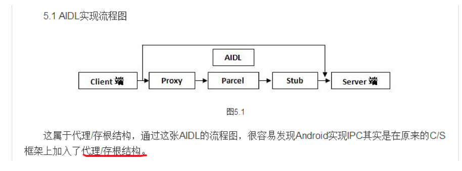

## 结论

- Stub 跟 Proxy 是一对，俗称“代理-桩” （或代理-存根），一般用在远程方法调用。
- Proxy 相当于是拿在手里的遥控器，而 Stub 相当于长在电视机里的遥控接收器，它们有着一一对应的接口方法，但操作的方向刚好相反。
- Proxy 的接口供客户端程序调用，然后它内部会把信息包装好，以某种方式（比如 RMI）传递给 Stub，而后者通过对应的接口作用于服务端系统，从而完成了“远程调用”。
- 一般不同进程间通信的时候都会用到这种模式（C/S或对接第三方）。

## 举例

客户端访问服务端的某个方法fn()，并非是由客户物件直接访问服务物件，而是客户端生成一个代理函数client_proxy_fn()，

通过代理函数来访问服务端;

同时，客户端代理函数也并不是直接访问服务端函数fn()，因为服务端也会生成一个桩函数 server-stub_fn()，由桩函数来承接来自客户端的远程请求。

从架构设计上来讲，此模式的引入，要么是为了`隔离变化`; 要么是为了降`低耦合`性（或者提`高内聚`）

## 实际场景-android ipc方式aidl就用到了这种方式

AIDL属于Android的IPC机制，常用于跨进程通信，主要实现原理基于底层Binder机制。

## 参考

[stub模式](https://blog.csdn.net/zhangyongfeiyong/article/details/77869590)

[一个stub模式例子](https://blog.csdn.net/u014002667/article/details/78989882)