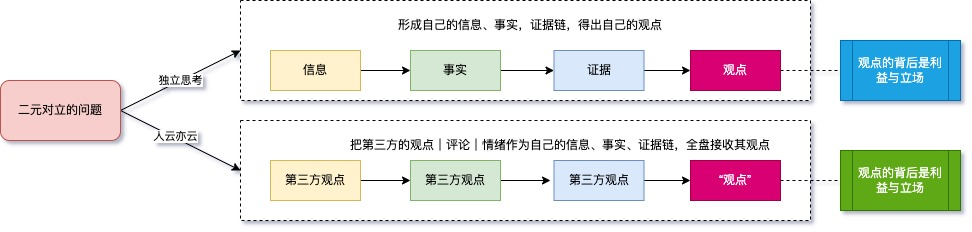

笔者家的小神兽慢慢长大，作为老父亲的我，时常思考如何对小神兽进行教育。

先说教育的意义，不同的历史时期、不同的教育家有不同的观点：

言传身教 - 这是经典的教育观

情商、智商、财商、逆商 - 这个是现代进化的教育观

读万卷书，不如如行万里路 - 这是朴素的实践教育观

文明其精神，野蛮其体魄 - 这是强调强体的重要性

苟利国家生死以，岂因祸福避趋之 - 这是士大夫阶层的爱国教育观

书中自有黄金屋，书中自有颜如玉 - 这是儒家功利主义教育观

见自己，见天地，见众生 - 这是道家哲学层面的教育观

立志、勤学、改过、责善 - 这是王阳明家书中的教育观

福慧双修、智悲双运 - 这是佛弟子的教育（修行）观

作为家长，其实不必要过多纠结，这些观念很多时候并不冲突，他们只是在不同的层面来阐述教育意义的。

作为家长，我们需要更多的聚焦在认识`教育制度的缺陷`与提升`家长自身教育观念`上。

国内家长在教育上普遍存在的一些问题：

- 居高临下，没有平等沟通，对小朋友缺乏尊重

- 永远觉得别人家的孩子比自己家孩子优秀，对自己的孩子缺乏发自内心的认同与赞美

- 对小孩子期望过高，进而道德绑架孩子，凡事都是我是为你好，你应该...

而国内的应试教育制度（环境）则存在以下常见的问题：

- 功利性强，且存在区域教育资源分配不平等的问题，有违教育的公平

- 死记硬背，填鸭式教育居多，卷出天际

- 不尊重个性与表达，打压`独立思考`，对`失败`与`创新`包容程度不够

教育制度的大环境无法改变，但是家庭教育的小环境我们家长可以自己决定，特别是对于`独立思考`，是我作为家长最看重的。我希望我的孩子不管未来如何变化，他都能够在纷杂的世界中保持清醒，拥有独立的思考与精神 - 达则兼治天下，穷则独善其身。

应试教育最大的弊端就是大部分的孩子缺乏独立思考，因为长期填鸭式的教育，环境的压迫下，同时为了学习效率，孩子不得不被动接收外部强加的观点，把被动接收的观点当作事实或证据，没有自己的思考也就没有自己的观点。

有些孩子天资聪颖，即使早期能够提出自己的观点，但其观点往往被视作异端（非标准答案），在长期的打压下，也只能**泯然众人矣**。

聪明的家长应该重视培养孩子独立思考的能力。

下面 ，我简单陈述一些思考过程的要素，以便了解独立思考的过程。

1. **问题或主题：** 这是你要思考的事情或话题，通常以一个问句或一个主题陈述的形式出现。例如，“为什么太阳会升起和落下？”或“关于环境保护有什么重要的事情？”

2. **信息：** 这是你需要了解的东西，它可以包括书、文章、互联网上的内容、人们的谈话等等。`信息`是回答问题或了解主题的基础。

3. **事实：** 事实是可以被证明是`真实`的陈述或信息。例如，太阳每天都会升起和落下，这是一个事实，因为它是可观察到的现象。

4. **证据：** 证据是支持观点或论点的事实。如果你要说太阳升起和落下是因为地球的自转，那么地球自转的速度和方向就是支持这个观点的证据。

5. **观点：** 观点是关于问题或主题的个人看法或信仰。不同的人可能持有不同的观点，这些观点可能基于他们的经验、信仰或价值观。相对事实，观点，有更强的主观性，是我们的感受、看法、价值观，难有标准答案。

   

   

*普通人常犯的错误：*

1，把脑海中**第三方的观点**当**证据**，忽略**事实**，从而形成错误的观点。比如：女孩子和男孩子吵架，女孩子哭了，就觉得女孩子肯定被男孩子欺负了 ，因为女孩子是弱者。

弱者容易被欺负，弱者很多时候只能哭 --- 这样的**第三方的观点**是长期的教育或者经验赋予我们的，因此我们看到女孩子哭（**信息**），就会直觉的觉得女孩子肯定被欺负了(**事实**)，并把脑海中固有的**第三方的观点**作为**证据**，最后得出自己的**“观点”**：这女孩子被这男孩子欺负了，女孩子遇人不淑啊。

注意：你脑海中的第三方的观点，正是长期的教育植入进去的，因为大脑也会偷懒，长期的灌输会让大脑形成坏习惯：把习得的观点、经验当作证据，忽略事实。

2，拿脑海中的**第三方的观点**来分析**事实** --- 观点应当被证明，而不能用来分析事实或证据。

*普通人应该拿出的态度：*

把**提问**贯穿信息、事实、证据、观点的全过程，充分利用逻辑学的方法，去伪存真。

这个过程有一个词叫：挑战权威。

人人这么做则只有一个结果：思想解放、全民创新。