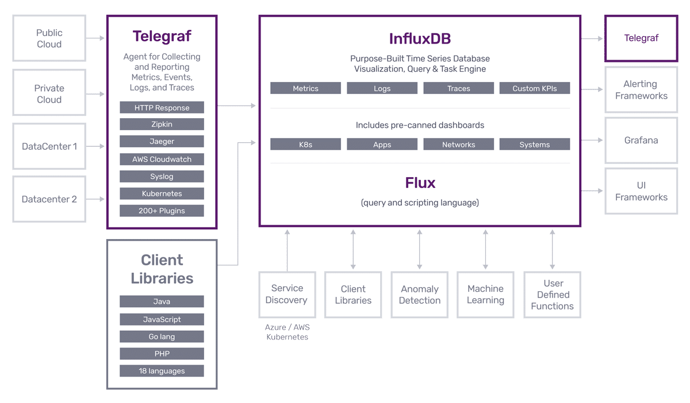

## 概念

记得2017年基于InfluxDb以及所谓的`TICK`监控解决方案，实现了公司近实时的业务监控，对核心业务指标进行监控预警，方便运营人员及时调整运营策略。

市面上，时序数据库的选型不少，比如OpenTSDB,Postgre(没错，它也可以变身时序数据库)-很多做模型的公司会选型postgre做模型样本数据的存储。

对于2017年提出的`TICK`这个历史概念，稍作介绍（**注意**：目前TICK已经不作为官方推荐方案）

### Telegraf

是一个数据收集和入库的工具。提供了很多 input 和 output 插件，比如收集本地的 cpu、load、网络流量等数据，然后写入 InfluxDB 或者 Kafka 等。Java里有类似的组件，比如Filebeat，Flume。

### InfluxDB

时序数据库，TICK的核心组件“I”。

### Chronograf

绘图工具，优点是默认绑定了 Kapacitor，缺点是难用。

### Kapacitor

Kapacitor是一款针对时序数据做优化的流式处理引擎，并通过插件机制实现通知功能。

Kapacitor处理一般分两种，一种是 stream，一种是 batch。stream 方式相当于 Kapacitor 一直接收 InfluxDB 传递过来的数据并做相应分析和告警；而 batch 则是自动定义查询间隔和周期，对数据做一些聚合计算后再告警。

### InfluxDB 2.0重磅发布

2020年，InfluxDB2.0发布，自身已经具备数据收集、存储、查询、处理、监控与提醒全能力，且提供了一种新型的数据查询与处理语言-`Flux`，因此`TICK`组合被统一进了InfluxDB 2.0中。之前`TICK`中需要学习多种查询语言的历史一去不返。

新版本的具体功能还在体验中，有不少惊喜。

## 优势

- 基于Go开发，安装部署方便，性能优越
- 极致的压缩效率，占用空间极低
- 新型查询处理语言`Flux`的身影贯穿数据的整个生命周期，极大的降低了开发人员学习成本

## 劣势

- 不支持集群（收费功能），不过一般小型应用足够用了（不差钱的企业花点钱买个集群方案也是洒洒水啦，这正是这家公司产品定位的精准之处，非常佩服）。