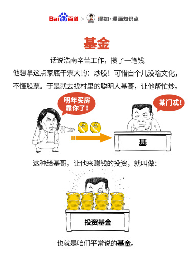
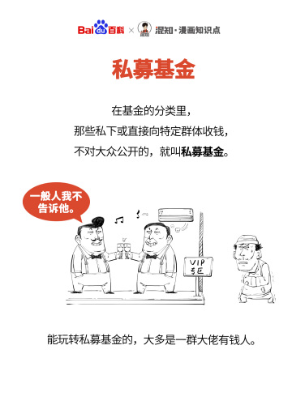
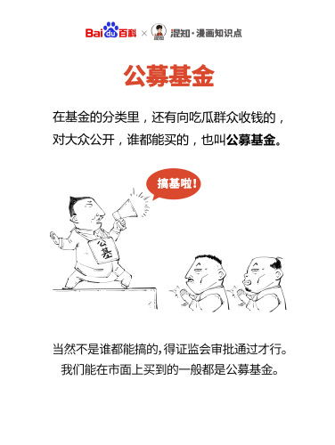

## 半年投资快评

个人2022年上半年收益20%+，跑赢上证指数。

2022上半年受疫情、加息、俄乌（美）战争影响 ，市场情绪降至冰点，指数最低达到2800点附近；之后，国家宏观政策频出，政策加持下背景下，亦有国家队的身影出现，指数收复3400点高点；

下半年，国际形势看不到缓和的迹象，国内地产行业、银行等高杠杆行业逐一暴雷，各个城市烂尾楼问题开始暴露在大众视野，通胀抬头，消费低迷，猪周期有抬头的迹象。

国际上，在通胀甚至衰退预期下，美国持续加息，企业盈利空间被压缩，大宗商品下行，芯片价格一路走低。

此两大背景下，还是保守防守为主，建议重点选择白酒、医药、电信等现金流较好、负债低的行业个股，适当关注猪周期反转个股，比如顺鑫农业。

新能源行业、光伏储能行业需要保持谨慎，个股需要精心选择。

**中国投资品种**

**1、****[房产](https://baike.baidu.com/item/房产)****。**很多人都投资房产，一家买n套房等着升值。

**2、****[债券](https://baike.baidu.com/item/债券)****。**债券有国债、金融债券、公司债券。这个比起股票风险低，但是收益也低。可以选择复利计息。国债是很多人都不能买到的，信誉好、利率优、风险小被称为“金边债券”。金融债券风险相对高些，公司的债券风险最大，收益最高。

**3、****[股票](https://baike.baidu.com/item/股票/22647)****。**中国的[股市](https://baike.baidu.com/item/股市)从2008年的6000多降到2011年的2000多，并且经济增长而股票不涨，中石油那么牛的企业它的股票也是不好，巴菲特是从中石油赚了35亿美元后华丽的退出了。有人说中国的股市和日本的很像，再也不可能再上到高点，只会在3000左右不断徘徊。可能与中国政府强大的势力有关吧。还有中国人民从众怕事的心理有关。

**4、****[贵金属](https://baike.baidu.com/item/贵金属/135025)****。**近几年比较热。“乱世买金”，在金融危机、欧债危机，世界不稳定因素太多，还有中国的通货膨胀比较厉害的情况下，很多人都转向黄金这个世界通用、价值稳定的物质。银行很多黄金产品，如黄金条块、纸黄金、黄金T+D。很多人也通过一些渠道做海外的黄金，不过很可能遇到黑平台，钱被弄平台的公司给全坑走了。中国承认的黄金交易机构只有[上海黄金交易所](https://baike.baidu.com/item/上海黄金交易所/10985829)。中国比较热的是炒白银，投入比较少些，黄金对资金的要求更多。

**5、****[基金](https://baike.baidu.com/item/基金)****。**基金是指为了某种目的而设立的具有一定数量的[资金](https://baike.baidu.com/item/资金)。主要包括信托[投资](https://baike.baidu.com/item/投资)基金、[公积金](https://baike.baidu.com/item/公积金)、保险基金、退休基金，各种基金会的基金。人们平常所说的基金主要是指[证券投资基金](https://baike.baidu.com/item/证券投资基金/3746)。

- 
- 
- 

**6、银行短期理财产品。**几天几天几个月，年化预计收益都是5%左右。不过这是“年化”。比较适合有短期大额闲余资金的公司或个人。

**7、****[信托](https://baike.baidu.com/item/信托)****。**最少100万，适合比较有钱的人。

**8、钱币古董的收藏。**有一定的收益，不过可能时间长，收益也不能保证。

**9、****[民间借贷](https://baike.baidu.com/item/民间借贷)****。**目前有一些机构做民间借贷的，收益可能在5%左右。

短期投资，是指能够随时变现并且持有时间不准备超过1年（含1年）的投资，包括股票、债券、基金等。