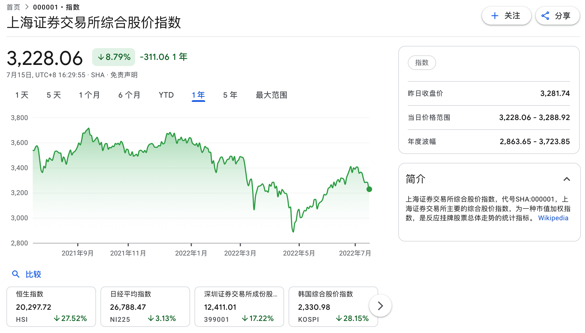

## 半年投资快评

个人2022年上半年收益20%+，跑赢上证指数。

2022上半年受疫情、加息、俄乌（美）战争影响 ，市场情绪降至冰点，指数最低达到2800点附近；之后，国家宏观政策频出，政策加持下背景下，亦有国家队的身影出现，指数收复3400点高点；

下半年，国际形势看不到缓和的迹象，国内地产行业、银行等高杠杆行业逐一暴雷，各个城市烂尾楼问题开始暴露在大众视野，通胀抬头，消费低迷，猪周期有抬头的迹象。

国际上，在通胀甚至衰退预期下，美国持续加息，企业盈利空间被压缩，大宗商品下行，芯片价格一路走低。

此两大背景下，还是保守防守为主，建议重点选择白酒、医药、电信等现金流较好、负债低的行业个股，适当关注猪周期反转个股，比如顺鑫农业。

新能源行业、光伏储能行业需要保持谨慎，个股需要精心选择。

