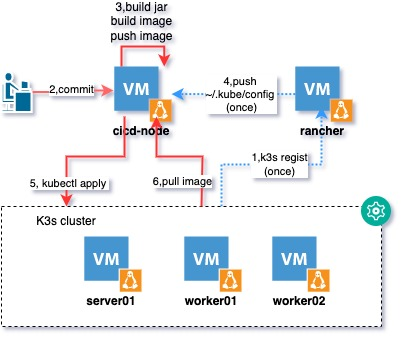
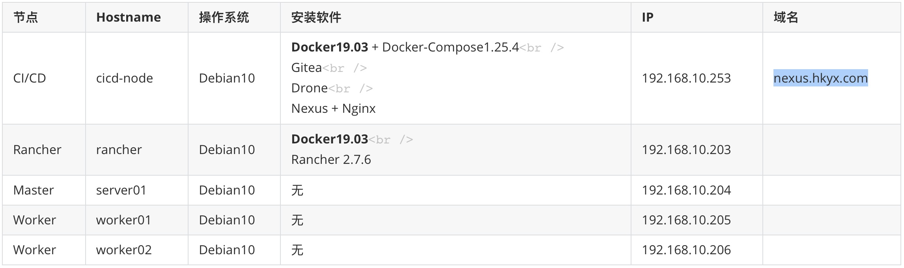
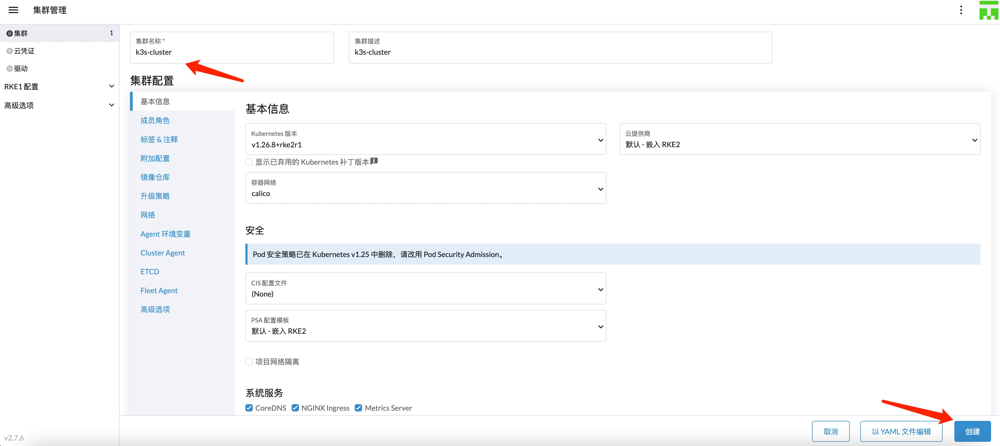
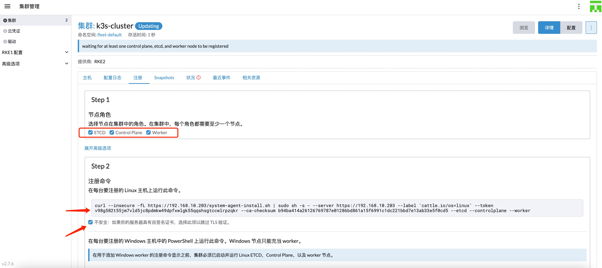
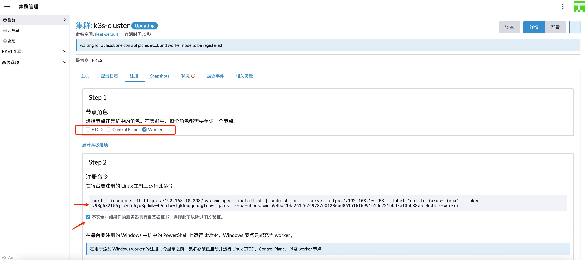
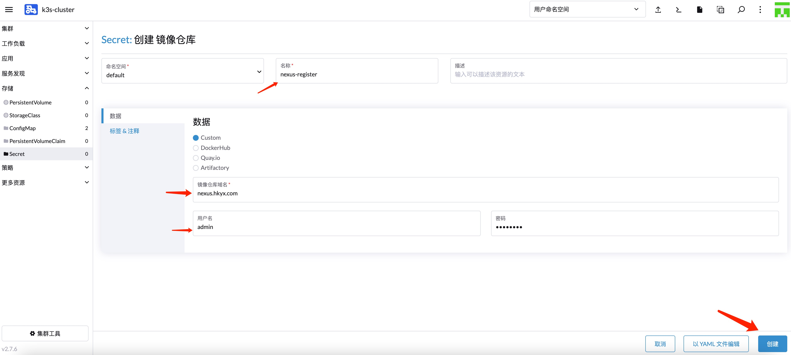

[TOC]

### 部署架构

- K3s：轻量级k8s集群，没有那么注重安全，针对LOT环境特殊优化。
- RKe：另外一种轻量级k8s集群，相对K3s更注重安全，暂时没有研究。
- Rancher：一种K8s集群管理工具，当然也可以用来管理K3s、RKe集群。
- 部署结构






### 搭建环境

#### 前置准备

- 每一个VM节点，请务必保证`hostname`、`IP`是固定且唯一的，不能重复或者冲突；同时设置域名neuxs.hkyx.com的解析地址。

  ```shell
  # 设置hostname
  $ sudo hostnamectl set-hostname xxxx
  
  $ sudo vi /etc/hosts
  127.0.1.1       xxxx
  
  # 设置静态IP
  $ sudo vi /etc/network/interfaces
  iface ens18 inet static
  address 192.168.10.xxx
  
  # 设置域名解析，保证每个VM节点都能识别该域名
  $ sudo vi /etc/hosts
  nexus.hkyx.com	192.168.10.253
  ```

  

- 请保证可以访问外网（师夷长技以制夷）

- 每个VM节点的用户都需要加入sudo组，可以执行sudo命令

- 每一个VM节点都需要关闭swap分区

  ```shell
  sudo swapoff -a
  sudo sed -i '/swap/s/^\(.*\)$/#\1/g' /etc/fstab
  ```

#### 证书

因为nexus作为镜像仓库要用到`nexus.hkyx.com`的域名 ，且rancher访问域名时必须使用`https`协议，所以我们需要生产https证书，并且同步ca证书到每一个VM节点。

##### 生产证书

登陆cicd-node，生成sans自签名证书：

```shell
# 创建ssl目录
$ cd ~ && mkdir ssl-sans && cd ssl-sans

# 生成根证书密钥ca.key
$ openssl genrsa -out ca.key 4096

# 生成自签名根证书ca.crt
$ openssl req -x509 -new -nodes -sha512 -days 3650 \
 -subj "/C=CN/ST=Beijing/L=Beijing/O=example/OU=Personal/CN=nexus.hkyx.com" \
 -key ca.key \
 -out ca.crt
 
# 生成nexus.hkyx.com.key
$ openssl genrsa -out nexus.hkyx.com.key 4096
 
# 生成nexus.hkyx.com.csr
$ openssl req -sha512 -new \
    -subj "/C=CN/ST=Beijing/L=Beijing/O=example/OU=Personal/CN=nexus.hkyx.com" \
    -key nexus.hkyx.com.key \
    -out nexus.hkyx.com.csr

# 生成v3.ext,sans扩展
$ cat > v3.ext <<-EOF
authorityKeyIdentifier=keyid,issuer
basicConstraints=CA:FALSE
keyUsage = digitalSignature, nonRepudiation, keyEncipherment, dataEncipherment
extendedKeyUsage = serverAuth
subjectAltName = @alt_names

[alt_names]
DNS.1=nexus.hkyx.com
DNS.2=nexus.hkyx
DNS.3=hostname
EOF

# 生成nexus.hkyx.com.crt
$ openssl x509 -req -sha512 -days 3650 \
  -extfile v3.ext \
  -CA ca.crt -CAkey ca.key -CAcreateserial \
  -in nexus.hkyx.com.csr \
  -out nexus.hkyx.com.crt
```

##### 同步证书

登陆cicd-node节点，复制nexus.hkyx.com.crt证书到每一个节点：

```shell
# 复制到cicd-node节点自身
$ sudo cp ~/ssl-sans/*.crt /tmp

# 复制到远程节点: rancher server01 worker01 worker02
$ sudo scp ~/ssl-sans/*.crt mac@192.168.10.203:/tmp
$ sudo scp ~/ssl-sans/*.crt mac@192.168.10.204:/tmp
$ sudo scp ~/ssl-sans/*.crt mac@192.168.10.205:/tmp
$ sudo scp ~/ssl-sans/*.crt mac@192.168.10.206:/tmp
```

##### 安装证书

在所有节点（cicd-node,rancher,server01,worker01,worker02）中分别执行如下命令：

```shell
$ sudo apt-get install ca-certificates
# 移动证书到/usr/share/ca-certificates/local
$ sudo mkdir -p /usr/share/ca-certificates/local 
$ sudo mv /tmp/*.crt /usr/share/ca-certificates/local
# 安装证书，敲空格选中nexus.hkyx.com.crt
$ sudo dpkg-reconfigure ca-certificates
```

#### 设置cicd-node节点

##### 安装Docker19.03 + Docker-Compose1.25.4

```shell
$ curl https://releases.rancher.com/install-docker/19.03.sh | sh

$ sudo vi /etc/docker/daemon.json
{
  "registry-mirrors": ["http://hub-mirror.c.163.com"],
  "insecure-registries":["192.168.10.253","nexus.hkyx.com"]
}

$ sudo systemctl restart docker

$ curl -L "https://github.com/docker/compose/releases/download/1.25.4/docker-compose-$(uname -s)-$(uname -m)" -o /usr/local/bin/docker-compose

$ sudo chmod +x /usr/local/bin/docker-compose

$ sudo docker-compose --version
```


##### 安装gitea

```shell
$ mkdir ~/gitea && cd ~/gitea
$ sudo vi docker-compose.yml
version: "3"
 
networks:
  gitea:
    external: false
 
services:
  server:
    image: gitea/gitea:1.16.7
    container_name: gitea
    environment:
      - USER_UID=1000
      - USER_GID=1000
    restart: always
    networks:
      - gitea
    volumes:
      - /home/data:/data  # /home/data可以替换成你想要的挂载目录
      - /etc/timezone:/etc/timezone:ro
      - /etc/localtime:/etc/localtime:ro
    ports:
      - "3000:3000" # 3030可以替换成你想要的端口
      - "2222:22" # 322可以替换成22
$ sudo docker-compose up -d
```


##### 安装drone

```shell
$ mkdir ~/drone && cd ~/drone
$ sudo vi docker-compose.yml
version: '3'
services:
  drone-server:
    restart: always
    image: drone/drone:2
    ports:
      - "1080:80"
    volumes:
      - /var/drone:/var/lib/drone/
      - /var/drone_data:/data/
    environment:
      - DRONE_GITEA_SERVER=http://192.168.10.253:3000
      - DRONE_GITEA_CLIENT_ID=581c2741-a131-40e3-bd16-1197a9a2b06b
      - DRONE_GITEA_CLIENT_SECRET=6yiusBvtBkIcltm2iIQ4siEgylpp7WN50Ld5pjE0PhE8
      - DRONE_SERVER_HOST=192.168.10.253:1080
      - DRONE_SERVER_PROTO=http
      - DRONE_RPC_SECRET=34e6c77e95ea65ac20d305fad7980b09
      - DRONE_GIT_ALWAYS_AUTH=true
      - DRONE_GIT_USERNAME=tfnick
      - DRONE_GIT_PASSWORD={你的密码}
      - DRONE_USER_CREATE=username:tfnick,admin:true
  drone-runner-docker:
    restart: always
    image: drone/drone-runner-docker:1
    ports:
      - "3001:3000"
    volumes:
      - /var/run/docker.sock:/var/run/docker.sock
    environment:
      - DRONE_RPC_PROTO=http
      - DRONE_RPC_HOST=drone-server
      - DRONE_RPC_SECRET=34e6c77e95ea65ac20d305fad7980b09
      - DRONE_RUNNER_NAME=drone-runner-docker
      - DRONE_RUNNER_CAPACITY=2
      
$ sudo docker-compose up -d
```

备注：

DRONE_GITEA_CLIENT_ID: gitea中配置oath2的client_id

DRONE_GITEA_CLIENT_SECRET: gitea中配置的oath2的client secret


##### 安装nexus + nginx

```shell
$ sudo mkdir -p /var/nexus-data && sudo chmod 777 -R /var/nexus-data
$ sudo docker run --restart=always -tid -p 8081:8081 -p 8082:8082 -p 8083:8083 -p 8084:8084 --name nexus -e NEXUS_CONTEXT=nexus -v /var/nexus-data:/nexus-data  docker.io/sonatype/nexus3 

$ sudo mkdir -p /var/docker-nginx/nginx && sudo mkdir -p /var/docker-nginx/logs

# 复制证书到宿主机的/var/docker-nginx/nginx/
$ sudo cp -r ~/ssl-sans/ /var/docker-nginx/nginx/

$ sudo docker run -p 80:80 -p 443:443 --name nginx --restart=always -v /var/docker-nginx/nginx:/etc/nginx -v /var/docker-nginx/logs:/var/log/nginx -d nginx

# 配置/var/docker-nginx/nginx/conf.d/default.conf
$ sudo vi /var/docker-nginx/nginx/conf.d/default.conf
upstream nexus_website {
    server 192.168.10.253:8081;
}
upstream nexus_docker_hosted {
    server 192.168.10.253:8082;
}
upstream nexus_docker_group {
    server 192.168.10.253:8084;
}

server {
    listen 80;
    
    # nexus对外的域名 
    server_name nexus.hkyx.com;

    #https配置开始
    listen       443 ssl;
    #这里是nginx的证书配置
    ssl_certificate      /etc/nginx/ssl-sans/nexus.hkyx.com.crt;
    ssl_certificate_key  /etc/nginx/ssl-sans/nexus.hkyx.com.key;

    ssl_session_cache    shared:SSL:1m;
    ssl_session_timeout  5m;

    ssl_ciphers  HIGH:!aNULL:!MD5;
    ssl_prefer_server_ciphers  on;
    #https配置结束

    access_log /var/log/nginx/nexus.hkyx.com.log main;
        
    # disable any limits to avoid HTTP 413 for large image uploads
    client_max_body_size 0;
    # required to avoid HTTP 411: 
    chunked_transfer_encoding on;
    # 设置默认使用推送代理
    set $upstream "nexus_docker_hosted";
    # 当请求是GET，也就是拉取镜像的时候，这里改为拉取代理，如此便解决了拉取和推送的端口统一
    if ( $request_method ~* 'GET') {
        set $upstream "nexus_docker_group";
    }
    # 只有本地仓库才支持搜索，所以将搜索请求转发到本地仓库，否则出现500报错
    if ($request_uri ~ '/search') {
        set $upstream "nexus_docker_hosted"; 
    }  
    index index.html index.htm index.php;
    location / {
            proxy_pass http://$upstream;
            proxy_set_header Host $host;
            proxy_connect_timeout 3600;
            proxy_send_timeout 3600;
            proxy_read_timeout 3600;
            proxy_set_header X-Real-IP $remote_addr;
            proxy_buffering off;
            proxy_request_buffering off;
            proxy_set_header X-Forwarded-For $proxy_add_x_forwarded_for;
            proxy_set_header X-Forwarded-Proto http;
    }
}

server {
    listen 80;
    server_name nexus-web.hkyx.com;
    access_log /var/log/nginx/nexus-web.log main;
    index index.html index.htm index.php;
    location /nexus { 
            proxy_pass http://nexus_website/nexus;
            proxy_set_header Host $host;
            client_max_body_size 512m;
            proxy_connect_timeout 3600;
            proxy_send_timeout 3600;
            proxy_read_timeout 3600;
            proxy_buffering off;
            proxy_request_buffering off;
    }
}
```

**设置**

- 配置tf-docker-hosted仓库，开启http端口8082
- 配置tf-docker-proxy仓库，开启http端口8083
  - Remote storage: https://mirror.baidubce.com 
  - Docker Index: Use Docker Hub
- 配置tf-docker-group仓库，开启http端口8084
  - Members: 选中 tf-docker-hosted,tf-docker-proxy
- Security - Realms，激活Docker Bearer Token Realm，以便后续其他节点可以执行sudo docker login 命令

**访问**

https://nexus.hkyx.com


#### 设置rancher节点

##### 安装Docker19.03 

```shell
$ curl https://releases.rancher.com/install-docker/19.03.sh | sh

$ sudo vi /etc/docker/daemon.json
{
  "registry-mirrors": ["http://hub-mirror.c.163.com"],
  "insecure-registries":["192.168.10.253","nexus.hkyx.com"]
}

$ sudo systemctl restart docker
```


##### 安装Rancher2.7.6

```shell
$ sudo mkdir -p /var/rancher-data
$ sudo docker run -d --privileged --restart=unless-stopped -p 80:80 -p 443:443 -v /var/rancher-data:/var/lib/rancher/  -v /usr/share/ca-certificates/local:/container/certs -e SSL_CERT_DIR="/container/certs" --add-host nexus.hkyx.com:192.168.10.253 --add-host nexus-web.hkyx.com:192.168.10.253 --privileged  rancher/rancher:v2.7.6
```

##### 配置Rancher2.7.6

- 创建集群k3s-cluster

  - 进入rancher首页，依次点击`创建`-`自定义`，输入集群名称后，点击 `创建`进行保存。

    

  - 查看用于注册k3s集群server01节点的命令

    

  - 查看用户注册k3s集群worker01,worker02节点的命令

    

- 创建集群的secret，后续从nexus拉取镜像会用到。（重要）

  进入k3s-cluster集群，依次点击`存储`-`Secret`-`创建`-`镜像仓库`，填入`nexus-registry`的地址和`凭证`信息。

  

#### 设置server01节点

注册该节点

```shell
$ curl --insecure -fL https://192.168.10.203/system-agent-install.sh | sudo  sh -s - --server https://192.168.10.203 --label 'cattle.io/os=linux' --token v98g582t55jm7vld5jc8pdmkw49dpfxwlgk55qqshsgtccwlrpzqkr --ca-checksum b94ba414a26126769787e01286bd861a15f6991c1dc221bbd7e13ab33e5f0cd5 --etcd --controlplane --worker
```


#### 设置worker01节点

注册该节点

```shell
$ curl --insecure -fL https://192.168.10.203/system-agent-install.sh | sudo  sh -s - --server https://192.168.10.203 --label 'cattle.io/os=linux' --token v98g582t55jm7vld5jc8pdmkw49dpfxwlgk55qqshsgtccwlrpzqkr --ca-checksum b94ba414a26126769787e01286bd861a15f6991c1dc221bbd7e13ab33e5f0cd5 --worker
```


#### 设置worker02节点

注册该节点

```shell
$ curl --insecure -fL https://192.168.10.203/system-agent-install.sh | sudo  sh -s - --server https://192.168.10.203 --label 'cattle.io/os=linux' --token v98g582t55jm7vld5jc8pdmkw49dpfxwlgk55qqshsgtccwlrpzqkr --ca-checksum b94ba414a26126769787e01286bd861a15f6991c1dc221bbd7e13ab33e5f0cd5 --worker
```


### 打通gitea+drone+nexus+rancher

#### 待续


### 参考

 [rancher + drone ci/cd](https://juejin.cn/post/7129066031875620894)
