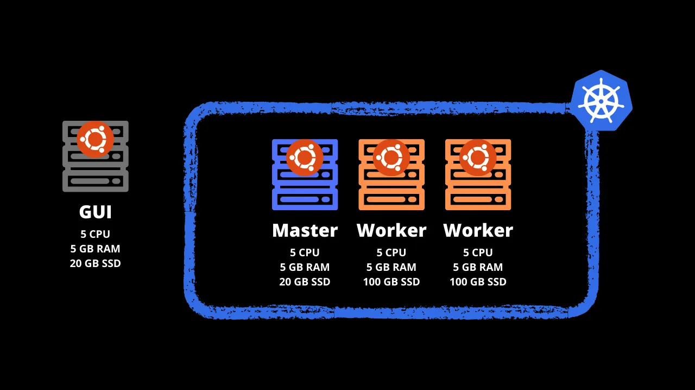
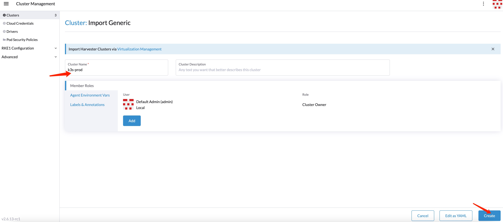
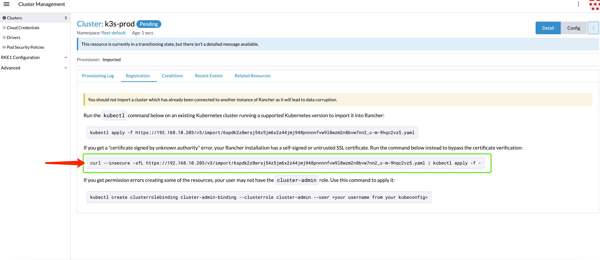
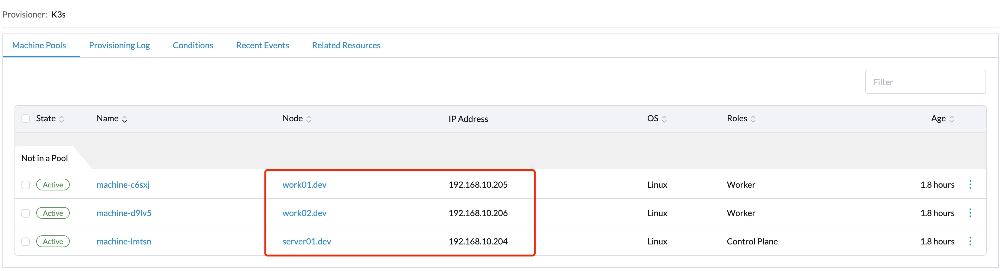

## 说明

- K3s：轻量级k8s集群，没有那么注重安全，针对LOT环境特殊优化。
- RKe：另外一种轻量级k8s集群，相对K3s更注重安全，暂时没有研究。
- Rancher：一种K8s集群管理工具，当然也可以用来管理K3s、RKe集群。
- 部署结构



- 部署节点说明 

  | 节点   | Hostname       | 职责                | 操作系统               | IP               |
  | ------ | -------------- | ------------------- | ---------------------- | ---------------- |
  | GUI    | `rancher`      | 安装Rancher         | Debian11 / ubuntu22.04 | `192.168.10.203` |
  | Master | `server01.dev` | 安装K3s的Master节点 | Debian11 / ubuntu22.04 | `192.168.10.204` |
  | Work   | `work01.dev`   | 安装K3s的Worker节点 | Debian11 / ubuntu22.04 | `192.168.10.205` |
  | Work   | `work02.dev`   | 安装K3s的Worker节点 | Debian11 / ubuntu22.04 | `192.168.10.206` |

  

## 前置条件

- 每一个节点，请务必保证`hostname`、`IP`是固定且唯一的，不能重复或者冲突。
- 请保证可以访问外网（师夷长技以制夷）
- 每个节点的用户都需要加入sudo组，可以执行sudo命令


## 第一步：搭建K3s集群

#### server01.dev

登陆server01.dev节点，安装Master并启动，注意：这里我们需要安装指定版本的K3S: v1.22.17+k3s1

```shell
$ curl -sfL https://get.k3s.io | INSTALL_K3S_VERSION=v1.22.17+k3s1 sh -s - --write-kubeconfig-mode 644 --node-name server01.dev
[sudo] password for mac: 
[INFO]  Using v1.22.17+k3s1 as release
[INFO]  Downloading hash https://github.com/k3s-io/k3s/releases/download/v1.22.17+k3s1/sha256sum-amd64.txt
[INFO]  Downloading binary https://github.com/k3s-io/k3s/releases/download/v1.22.17+k3s1/k3s
[INFO]  Verifying binary download
[INFO]  Installing k3s to /usr/local/bin/k3s
[INFO]  Skipping installation of SELinux RPM
[INFO]  Creating /usr/local/bin/kubectl symlink to k3s
[INFO]  Creating /usr/local/bin/crictl symlink to k3s
[INFO]  Creating /usr/local/bin/ctr symlink to k3s
[INFO]  Creating killall script /usr/local/bin/k3s-killall.sh
[INFO]  Creating uninstall script /usr/local/bin/k3s-uninstall.sh
[INFO]  env: Creating environment file /etc/systemd/system/k3s.service.env
[INFO]  systemd: Creating service file /etc/systemd/system/k3s.service
[INFO]  systemd: Enabling k3s unit
Created symlink /etc/systemd/system/multi-user.target.wants/k3s.service → /etc/systemd/system/k3s.service.
[INFO]  systemd: Starting k3s
```

查看节点是否正常启动：

```shell
$ sudo kubectl  get nodes
NAME           STATUS   ROLES                  AGE   VERSION
server01.dev   Ready    control-plane,master   42s   v1.22.17+k3s1
```

查看主节点的token，作为后续work节点安装命令中的K3S_TOKEN参数：

```shell
$ sudo cat /var/lib/rancher/k3s/server/node-token
K108b6e09e0309379530a839b05d293a38ec52e0f2535821ed7cb9dcb4a1f6a8c70::server:3d60c753f8a85e07f8d8484ecb0e96ab
```

#### work01.dev

安装集群work01节点，并加入主节点所在集群，请按需填写你自己的K3S_NODE_NAME、K3S_URL、K3S_TOKEN：

```shell
$ curl -sfL https://get.k3s.io | INSTALL_K3S_VERSION=v1.22.17+k3s1 K3S_NODE_NAME=work01.dev K3S_URL=https://192.168.10.204:6443 K3S_TOKEN=K108b6e09e0309379530a839b05d293a38ec52e0f2535821ed7cb9dcb4a1f6a8c70::server:3d60c753f8a85e07f8d8484ecb0e96ab sh -

[sudo] password for mac: 
[INFO]  Using v1.22.17+k3s1 as release
[INFO]  Downloading hash https://github.com/k3s-io/k3s/releases/download/v1.22.17+k3s1/sha256sum-amd64.txt
[INFO]  Downloading binary https://github.com/k3s-io/k3s/releases/download/v1.22.17+k3s1/k3s
[INFO]  Verifying binary download
[INFO]  Installing k3s to /usr/local/bin/k3s
[INFO]  Skipping installation of SELinux RPM
[INFO]  Creating /usr/local/bin/kubectl symlink to k3s
[INFO]  Creating /usr/local/bin/crictl symlink to k3s
[INFO]  Creating /usr/local/bin/ctr symlink to k3s
[INFO]  Creating killall script /usr/local/bin/k3s-killall.sh
[INFO]  Creating uninstall script /usr/local/bin/k3s-agent-uninstall.sh
[INFO]  env: Creating environment file /etc/systemd/system/k3s-agent.service.env
[INFO]  systemd: Creating service file /etc/systemd/system/k3s-agent.service
[INFO]  systemd: Enabling k3s-agent unit
Created symlink /etc/systemd/system/multi-user.target.wants/k3s-agent.service → /etc/systemd/system/k3s-agent.service.
[INFO]  systemd: Starting k3s-agent
```

#### work02.dev

安装集群work02节点，并加入主节点所在集群，请按需填写你自己的K3S_NODE_NAME、K3S_URL、K3S_TOKEN：

```shell
$ curl -sfL https://get.k3s.io | INSTALL_K3S_VERSION=v1.22.17+k3s1 K3S_NODE_NAME=work02.dev K3S_URL=https://192.168.10.204:6443 K3S_TOKEN=K108b6e09e0309379530a839b05d293a38ec52e0f2535821ed7cb9dcb4a1f6a8c70::server:3d60c753f8a85e07f8d8484ecb0e96ab sh -

[sudo] password for mac: 
[INFO]  Using v1.22.17+k3s1 as release
[INFO]  Downloading hash https://github.com/k3s-io/k3s/releases/download/v1.22.17+k3s1/sha256sum-amd64.txt
[INFO]  Downloading binary https://github.com/k3s-io/k3s/releases/download/v1.22.17+k3s1/k3s
[INFO]  Verifying binary download
[INFO]  Installing k3s to /usr/local/bin/k3s
[INFO]  Skipping installation of SELinux RPM
[INFO]  Creating /usr/local/bin/kubectl symlink to k3s
[INFO]  Creating /usr/local/bin/crictl symlink to k3s
[INFO]  Creating /usr/local/bin/ctr symlink to k3s
[INFO]  Creating killall script /usr/local/bin/k3s-killall.sh
[INFO]  Creating uninstall script /usr/local/bin/k3s-agent-uninstall.sh
[INFO]  env: Creating environment file /etc/systemd/system/k3s-agent.service.env
[INFO]  systemd: Creating service file /etc/systemd/system/k3s-agent.service
[INFO]  systemd: Enabling k3s-agent unit
Created symlink /etc/systemd/system/multi-user.target.wants/k3s-agent.service → /etc/systemd/system/k3s-agent.service.
[INFO]  systemd: Starting k3s-agent
```

#### 检查K3s集群状态

登陆server01.dev节点：

```shell
$ sudo kubectl  get nodes
NAME           STATUS   ROLES                  AGE   VERSION
work01.dev     Ready    <none>                 66m   v1.22.17+k3s1
server01.dev   Ready    control-plane,master   70m   v1.22.17+k3s1
work02.dev     Ready    <none>                 67m   v1.22.17+k3s1
```

出现3个节点，并且状态是Ready，表示K3s集群已经就绪。


## 第二步：部署Rancher

登陆rancher节点，安装docker指定版本：

 ```shell
 $ curl https://releases.rancher.com/install-docker/20.10.sh | sh
 ```

使用docker安装指定版本的Rancher：

```shell
$ sudo docker run --privileged -d --restart=unless-stopped -p 80:80 -p 443:443 rancher/rancher:v2.6.13-rc1
```

访问 https://{RANCHER IP} 即 https://192.168.10.203 按提示修改管理员密码即完成Rancher的安装

## 第三步：在Rancher中导入第一步搭建的K3s集群

使用管理员登陆https://192.168.10.203，依次点击**Cluster Management** -- **Import Existing** -- **Generic**，输入集群名（Cluster-name）:   **k3s-prod**



找到导入指令(**复制**红色箭头所示的shell命令)：




登陆节点**server01.dev**，粘贴复制的shell命令并执行：

```shell
$ curl --insecure -sfL https://192.168.10.203/v3/import/6spdk2z8wrsj54z5jm6x2z44jmj948pnnnnfvw9l8wzm2n8bvw7nn2_c-m-9hqc2vz5.yaml | kubectl apply -f -
```

指令执行后，使用管理员登陆https://192.168.10.203 ，确认  **k3s-prod**集群从**Pending**变为**Active**，这个过程大约需要10分钟左右。

最终在Rancher后台管理中，集群**k3s-prod**下可以发现3个节点如下：



至此，Rancher + K3s部署完毕。

Rancher可以进行多集群管理，如果你有其他的集群，也可以按同样的操作导入到Rancher中。

需要注意的是Rancher与K3s版本需要有对应关系，这也是本次教程使用指定版本安装Rancher与K3s的原因。

本次安装Rancher是单节点安装，如果您是用于生产环境，需要安装Rancher集群，可以参考官网。

## 卸载K3s集群

- 卸载server01.dev

  ```shell
  $ /usr/local/bin/k3s-uninstall.sh
  ```

  

- 卸载work01.dev

  ```shell
  $ /usr/local/bin/k3s-agent-uninstall.sh
  ```

  

- 卸载work02.dev

  ```shell
  $ /usr/local/bin/k3s-agent-uninstall.sh
  ```

  
