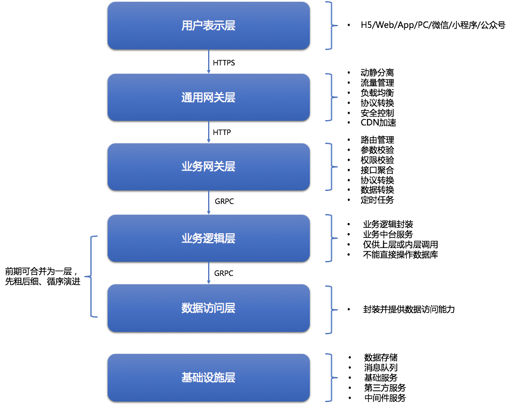

## 分层

## 一、用户表示层

直接与用户交互的一层，一般是前端系统，例如：H5、App、微信/公众号/小程序等。也可以是独立的第三方系统，例如HIS、ERP、百度/腾讯平台等。比较形象的是一些常用前后端分离的应用设计方案，例如我们的App端，或者采用Vue/React框架的前端，表示层一般就是这些客户端/前端管理系统，通过网关暴露的Api来实现数据交互。

## 二、通用网关层

与业务无关的请求接入层，一般是Nginx/Kong或者Istio的Api-Gateway中间件，核心作用如下：

### 1、动静分离

静态资源和动态Api接口分开管理，以便于静态资源的CDN。

### 2、流量管理

通用网关是所有请求流量的入口，可以对流量执行多种管理方式。

### 3、负载均衡

通用网关必须是多节点集群方式部署，负责均衡终端用户的流量，防止单点故障。

### 4、协议转换

通用网关负责HTTPS->HTTP的协议转换，从外部HTTPS加密通信转换为内部可信的HTTP普通请求。

### 5、安全控制

通用网关统一通过HTTPS加密通信方式接入。此外，对网络级的系统安全性（防DDOS、钓鱼、跨域等）、请求监控等也是由通用网关层负责。一些第三方的安全产品，也是在这一层接入。

### 6、CDN加速

由于通用网关负责请求资源的动静分离，静态资源不通过内部服务转发（浪费性能）而是由通用网关统一维护存储规则，CDN加速将静态资源进行CDN同步，第三方的CDN仅会在回源的时候会请求到通用网关。

## 三、业务网关层

业务网关层往往又被称作业务聚合层，该层由若干个业务服务构成，负责接收通用网关转发过来的流量。医联架构中的端口层的作用与业务网关层相同。核心作用如下：

### 1、路由管理

业务网关层的服务负责自己服务的路由表维护。

### 2、参数校验

业务网关层的服务负责执行与客户端约定的参数校验，验证通过之后再组装成后端微服务需要的数据结构请求到后端。

### 3、权限校验

各个业务网关层的服务通过底层的用户服务调用来实现权限校验，对于哪些路由需要权限校验，哪些路由不需要，完全由业务网关层的服务自行维护。

### 4、接口聚合

业务网关层的服务可能需要调用多个后端的微服务来组合实现一个接口，根据自身需求来对下层返回的数据进行聚合和处理。

### 5、协议转换

业务网关层的服务接收转发过来的HTTP请求，并转换为内部的一个或者多个GRPC微服务调用来实现接口逻辑。

### 6、数据转换

业务网关层的服务的输入和输出数据结构必须是表示层需要的，因此它所负责的数据结构和后端GRPC微服务的数据结构会不一样。业务网关层的服务需要负责数据结构的转换和封装处理。

### 7、定时任务

是的，定时任务放在这一层。定时任务不属于微服务，也不提供HTTP API，往往是一个独立的守护进程部署，调用内部的微服务实现业务逻辑。

## 四、业务逻辑层

对业务逻辑的封装，是业务软件的核心。高内聚，低耦合，复用，解耦。

业务逻辑层中的服务在实际场景中不可避免的会存在相互请求调用的场景，这种情况往往需要将耦合的功能进行下沉，数据请求可以下沉为数据访问层服务，业务的可以下沉为稳定的通用业务服务。

## 五、数据访问层

数据访问层主要的作用是对数据访问请求做统一的收口，试想一下，假如没有数据访问层服务的存在，那么几乎所有的业务逻辑层服务都会与数据库绑定依赖（明显的现象是配置中存在多个数据库配置），耦合性较高。

_7640822038535504706.png)

_2763593700876134392.png)

业务数据访问往往是会被给各个业务服务访问，被依赖程度往往比较高。将数据访问能力从业务逻辑层中单独剥离了出来，形成相对稳定的服务。

对于微服务架构架构的前期，开发效率会成为第一考量的优先级，过细的层级划分结构其实会增加一定的维护成本，因此微服务架构前期来讲没有必要将层次划分这么细，可以根据业务场景需要选择性地实现数据访问层的建设。

## 六、基础设施层

基础设施层是与业务无关的一层，主要包含的是数据存储和基础服务。

### 1、数据存储

例如MySQL、MongoDB、Redis等等数据服务。

### 2、消息队列

例如Kafka、RocketMQ等等。

### 3、基础服务

例如短信、邮件、Push、文件、微信、IM等服务。

### 4、第三方服务

例如七牛、阿里云等服务。

### 5、中间件服务

例如分布式锁、分布式事务、数据库Client等。

## 七、常见问题

### 1、层级访问顺序

- 业务请求在层级间应当是从上至下顺序访问的。
- 微服务跨层级访问是不允许的。例如，业务网关层是不应当直接去调用数据访问层。
- 下层如果存在向上层发起的通信只能通过中间件等间接方式进行。

### 2、基础设施层是否只能层级顺序访问？

- 基础设施层虽然在分层模型中展示在最底层，但是却允许被微服务分层模型中的任何一层访问。

### 3、同一个业务是否需要创建不同的项目仓库以适应不同分层？

- 不需要。微服务分层模型要求 程序架构 设计和 部署架构 设计切合，但是代码维护是放一个还是多个仓库没作要求。