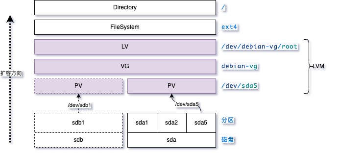
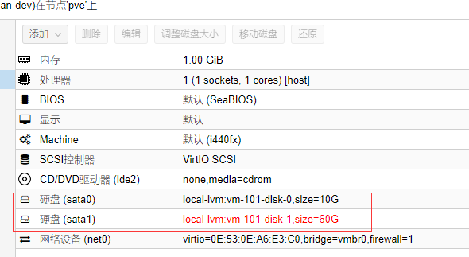

[TOC]

## 概念

每个虚拟机都是需要一块硬盘的，实际是从宿主机划分出来的给虚拟机使用的。

PVE虚拟机是基于linux的，它使用LVM管理宿主机磁盘，所以每个虚拟机仅仅是从LVM的VG（volume group卷组）中新建一个固定大小的LV（logical volume），提供给特定的一个虚拟机实例作为虚拟化的硬盘使用。

想实现虚拟机硬盘动态扩容，我们必须明白linux的LVM硬盘管理，因为只有LVM可以实现对一个已有的硬盘分区扩容。


- 块设备：插在机器上的一块硬盘。
- 硬盘分区：把块设备分成多个分区，每个分区固定大小。
- 文件系统：如果想要使用硬盘某分区，需要在这个分区上制作文件系统，比如：ext4格式。
- 挂载目录：最终把做好的文件系统通过mount命令挂载到某个目录下，就可以读写分区内的数据了。


传统硬盘分区方案的问题是，一旦我们把操作系统安装到某个分区内，那么这个分区大小就无法改变了，随着数据变多硬盘就塞满了。想要扩容的话，我们只能选定某个目录挂载一块新的硬盘，然后把一些较大的数据手动迁移进去，总之我们会因为容量问题严重影响到使用体验。

LVM则可以对一个已有的文件系统（当然对应一个硬盘分区）进行扩容，这就是它厉害的地方。


**LVM硬盘扩容的使用过程是这样的**：

- 准备块设备（/dev/sdx）：给机器插上**新的硬盘**。
- 准备硬盘分区（/dev/sdx1）：把块设备分成多个**硬盘分区**（1个分区用尽整块磁盘也可以，无所谓），每个分区的大小也是固定的。
- 新建物理卷（PV）：按照LVM的规则，把每个硬盘分区创建为一个物理卷（physical volume）。
- 扩容已有卷池（VG）：新建的物理卷就像一桶矿泉水，把它们加入到一个VG大池子里面，这样池子里的水（硬件空间）就会变多。
- 扩容已有逻辑卷（LV）：VG扩大了，则可以新增逻辑卷LV或者扩容已有的逻辑卷LV。
- 刷新文件系统（fs）：现在可以对LV制作文件系统，比如：ext4格式。
- 挂载目录（已经挂载过的目录则可以跳过）：现在可以把在做好文件系统的LV挂载到某个目录，就可以访问了。


## 案例



### 查看现状（/dev/sda）

我有一个debian虚拟机，一开始只给了它10G的虚拟化硬盘：

```shell
$ lsblk 
NAME                  MAJ:MIN RM  SIZE RO TYPE MOUNTPOINT
sda                     8:0    0   10G  0 disk 
├─sda1                  8:1    0  243M  0 part /boot
├─sda2                  8:2    0    1K  0 part 
└─sda5                  8:5    0  9.8G  0 part 
  ├─debian--vg-root   254:0    0  8.8G  0 lvm  /
  └─debian--vg-swap_1 254:1    0    1G  0 lvm  [SWAP]
sr0                    11:0    1 1024M  0 rom
```

sda就是10G的盘，被分成了3个分区：sda1、sd2、sda5

sda1是引导分区，sda2不知道是什么作用，sda5是一个LVM类型的分区，我们详细分析一下这个分区：

```shell
$ pvdisplay 
  --- Physical volume ---
  PV Name               /dev/sda5
  VG Name               debian-vg
  PV Size               <9.76 GiB / not usable 2.00 MiB
  Allocatable           yes (but full)
  PE Size               4.00 MiB
  Total PE              2498
  Free PE               0
  Allocated PE          2498
  PV UUID               iaVwL9-NGGB-c5zT-ZNze-2KNU-JGql-0hrqi2
```

pv display就是看PV，可见/dev/sd5分区被创建为了一个PV，它被加入到了VG池子debian-vg中，所以我们再看一下debian-vg这个池子：

```shell
$ vgdisplay 
  --- Volume group ---
  VG Name               debian-vg
  System ID             
  Format                lvm2
  Metadata Areas        1
  Metadata Sequence No  3
  VG Access             read/write
  VG Status             resizable
  MAX LV                0
  Cur LV                2
  Open LV               2
  Max PV                0
  Cur PV                1
  Act PV                1
  VG Size               <9.76 GiB
  PE Size               4.00 MiB
  Total PE              2498
  Alloc PE / Size       2498 / <9.76 GiB
  Free  PE / Size       0 / 0   
  VG UUID               kGnJvc-zPnf-BYYz-NA6c-O33X-8yp1-3Z6Sey
```

VG被划分出2个LV供使用，我们看一下是哪些LV：

```shell
$ lvdisplay 
  --- Logical volume ---
  LV Path                /dev/debian-vg/root
  LV Name                root
  VG Name                debian-vg
  LV UUID                GeeBqg-syni-CUpM-XogW-94uV-6b8G-lZB3GJ
  LV Write Access        read/write
  LV Creation host, time debian, 2020-02-09 12:43:24 +0800
  LV Status              available
  # open                 1
  LV Size                <8.76 GiB
  Current LE             2242
  Segments               1
  Allocation             inherit
  Read ahead sectors     auto
  - currently set to     256
  Block device           254:0
   
  --- Logical volume ---
  LV Path                /dev/debian-vg/swap_1
  LV Name                swap_1
  VG Name                debian-vg
  LV UUID                sb3u5h-IBDs-xcvF-cT4f-cxDy-6Ui0-GyvOP7
  LV Write Access        read/write
  LV Creation host, time debian, 2020-02-09 12:43:24 +0800
  LV Status              available
  # open                 2
  LV Size                1.00 GiB
  Current LE             256
  Segments               1
  Allocation             inherit
  Read ahead sectors     auto
  - currently set to     256
  Block device           254:1
```

可见，2个LV类似于2个块设备，路径分别是/dev/debian-vg/root和/dev/debian-bg/swap_1，这是debian安装操作系统过程中创建好的。

第一个LV安装操作系统的所有内容，所以占了大部分空间，大约是8.76G；后者是作为swap分区使用的，大约是1GB。

有了LV，就可以做文件系统了，我们可以看一下：

```shell
$ df -h
文件系统                     容量  已用  可用 已用% 挂载点
udev                         479M     0  479M    0% /dev
tmpfs                         99M  2.9M   96M    3% /run
/dev/mapper/debian--vg-root  8.6G  1.3G  6.9G   16% /
tmpfs                        494M     0  494M    0% /dev/shm
tmpfs                        5.0M     0  5.0M    0% /run/lock
tmpfs                        494M     0  494M    0% /sys/fs/cgroup
/dev/sda1                    236M   84M  140M   38% /boot
tmpfs                         99M     0   99M    0% /run/user/1000
```

可见，root那个LV被挂载到了/根目录，所以整个操作系统都在占用这个LV的空间，后续我们一旦发现硬盘耗尽，就需要对这个LV进行原地扩容即可。


### 准备块设备（/dev/sdb）

我们通过PVE管理后台增加一块新的60G的硬盘：



```shell
$ lsblk 
NAME                  MAJ:MIN RM  SIZE RO TYPE MOUNTPOINT
sda                     8:0    0   10G  0 disk 
├─sda1                  8:1    0  243M  0 part /boot
├─sda2                  8:2    0    1K  0 part 
└─sda5                  8:5    0  9.8G  0 part 
  ├─debian--vg-root   254:0    0  8.8G  0 lvm  /
  └─debian--vg-swap_1 254:1    0    1G  0 lvm  [SWAP]
sdb                     8:16   0   60G  0 disk 
sr0                    11:0    1 1024M  0 rom
```


### 准备硬盘分区（/dev/sdb1）

```shell
$ fdisk /dev/sdb

# 新建一个主分区
Command (m for help): n
Partition type
   p   primary (0 primary, 0 extended, 4 free)
   e   extended (container for logical partitions)
Select (default p): p
Partition number (1-4, default 1): 
First sector (2048-125829119, default 2048): 
Last sector, +/-sectors or +/-size{K,M,G,T,P} (2048-125829119, default 125829119): 
 
Created a new partition 1 of type 'Linux' and of size 60 GiB.

# 转换分区类型为LVM
Command (m for help): t 
Selected partition 1
Hex code (type L to list all codes): L
 
 0  Empty           24  NEC DOS         81  Minix / old Lin bf  Solaris        
 1  FAT12           27  Hidden NTFS Win 82  Linux swap / So c1  DRDOS/sec (FAT-
 2  XENIX root      39  Plan 9          83  Linux           c4  DRDOS/sec (FAT-
 3  XENIX usr       3c  PartitionMagic  84  OS/2 hidden or  c6  DRDOS/sec (FAT-
 4  FAT16 <32M      40  Venix 80286     85  Linux extended  c7  Syrinx         
 5  Extended        41  PPC PReP Boot   86  NTFS volume set da  Non-FS data    
 6  FAT16           42  SFS             87  NTFS volume set db  CP/M / CTOS / .
 7  HPFS/NTFS/exFAT 4d  QNX4.x          88  Linux plaintext de  Dell Utility   
 8  AIX             4e  QNX4.x 2nd part 8e  Linux LVM       df  BootIt         
 9  AIX bootable    4f  QNX4.x 3rd part 93  Amoeba          e1  DOS access     
 a  OS/2 Boot Manag 50  OnTrack DM      94  Amoeba BBT      e3  DOS R/O        
 b  W95 FAT32       51  OnTrack DM6 Aux 9f  BSD/OS          e4  SpeedStor      
 c  W95 FAT32 (LBA) 52  CP/M            a0  IBM Thinkpad hi ea  Rufus alignment
 e  W95 FAT16 (LBA) 53  OnTrack DM6 Aux a5  FreeBSD         eb  BeOS fs        
 f  W95 Ext'd (LBA) 54  OnTrackDM6      a6  OpenBSD         ee  GPT            
10  OPUS            55  EZ-Drive        a7  NeXTSTEP        ef  EFI (FAT-12/16/
11  Hidden FAT12    56  Golden Bow      a8  Darwin UFS      f0  Linux/PA-RISC b
12  Compaq diagnost 5c  Priam Edisk     a9  NetBSD          f1  SpeedStor      
14  Hidden FAT16 <3 61  SpeedStor       ab  Darwin boot     f4  SpeedStor      
16  Hidden FAT16    63  GNU HURD or Sys af  HFS / HFS+      f2  DOS secondary  
17  Hidden HPFS/NTF 64  Novell Netware  b7  BSDI fs         fb  VMware VMFS    
18  AST SmartSleep  65  Novell Netware  b8  BSDI swap       fc  VMware VMKCORE 
1b  Hidden W95 FAT3 70  DiskSecure Mult bb  Boot Wizard hid fd  Linux raid auto
1c  Hidden W95 FAT3 75  PC/IX           bc  Acronis FAT32 L fe  LANstep        
1e  Hidden W95 FAT1 80  Old Minix       be  Solaris boot    ff  BBT            
Hex code (type L to list all codes): 8e
Changed type of partition 'Linux' to 'Linux LVM'.

# 保存分区并退出

Command (m for help): p
Disk /dev/sdb: 60 GiB, 64424509440 bytes, 125829120 sectors
Disk model: QEMU HARDDISK   
Units: sectors of 1 * 512 = 512 bytes
Sector size (logical/physical): 512 bytes / 512 bytes
I/O size (minimum/optimal): 512 bytes / 512 bytes
Disklabel type: dos
Disk identifier: 0x13622708
 
Device     Boot Start       End   Sectors Size Id Type
/dev/sdb1        2048 125829119 125827072  60G 8e Linux LVM
 
Command (m for help): w
The partition table has been altered.
Calling ioctl() to re-read partition table.
Syncing disks.
```

### 新建物理卷（PV）

```shell
$ pvcreate /dev/sdb1
  Physical volume "/dev/sdb1" successfully created.
```

### 扩容已有卷池（VG）

```shell
$ vgextend debian-vg /dev/sdb1
  Volume group "debian-vg" successfully extended
  
$ vgdisplay --units B
  --- Volume group ---
  VG Name               debian-vg
  System ID             
  Format                lvm2
  Metadata Areas        2
  Metadata Sequence No  4
  VG Access             read/write
  VG Status             resizable
  MAX LV                0
  Cur LV                2
  Open LV               2
  Max PV                0
  Cur PV                2
  Act PV                2
  VG Size               74897686528 B 
  PE Size               4194304 B 
  Total PE              17857
  Alloc PE / Size       2498 / 10477371392 B 
  Free  PE / Size       15359 / 64420315136 B 
  VG UUID               kGnJvc-zPnf-BYYz-NA6c-O33X-8yp1-3Z6Sey
```

### 扩容已有逻辑卷（LV）

```shell
$ lvresize -L 64420315136B /dev/debian-vg/root
  Size of logical volume debian-vg/root changed from <8.76 GiB (2242 extents) to <60.00 GiB (15359 extents).
  Logical volume debian-vg/root successfully resized.
  
# 查看已更新的LV
$ lsblk 
NAME                  MAJ:MIN RM  SIZE RO TYPE MOUNTPOINT
sda                     8:0    0   10G  0 disk 
├─sda1                  8:1    0  243M  0 part /boot
├─sda2                  8:2    0    1K  0 part 
└─sda5                  8:5    0  9.8G  0 part 
  ├─debian--vg-root   254:0    0   60G  0 lvm  /
  └─debian--vg-swap_1 254:1    0    1G  0 lvm  [SWAP]
sdb                     8:16   0   60G  0 disk 
└─sdb1                  8:17   0   60G  0 part 
  └─debian--vg-root   254:0    0   60G  0 lvm  /
sr0                    11:0    1 1024M  0 rom
```

### 刷新文件系统（fs）

```shell
# 文件系统大小尚未更新
$ df -h
文件系统                     容量  已用  可用 已用% 挂载点
udev                         479M     0  479M    0% /dev
tmpfs                         99M  2.9M   96M    3% /run
/dev/mapper/debian--vg-root  8.6G  1.3G  6.9G   17% /
tmpfs                        494M     0  494M    0% /dev/shm
tmpfs                        5.0M     0  5.0M    0% /run/lock
tmpfs                        494M     0  494M    0% /sys/fs/cgroup
/dev/sda1                    236M   84M  140M   38% /boot
tmpfs                         99M     0   99M    0% /run/user/1000

$ resize2fs /dev/debian-vg/root
resize2fs 1.44.5 (15-Dec-2018)
Filesystem at /dev/debian-vg/root is mounted on /; on-line resizing required
old_desc_blocks = 2, new_desc_blocks = 8
The filesystem on /dev/debian-vg/root is now 15727616 (4k) blocks long.
```


### 挂载目录

因为这个LV挂载在/下面（也就是操作系统），所以属于一种在线文件扩容操作。可以直接查看文件系统，已经扩容完成：

```shell
$ df -h
文件系统                     容量  已用  可用 已用% 挂载点
udev                         479M     0  479M    0% /dev
tmpfs                         99M  2.9M   96M    3% /run
/dev/mapper/debian--vg-root   60G  1.4G   56G    3% /
tmpfs                        494M     0  494M    0% /dev/shm
tmpfs                        5.0M     0  5.0M    0% /run/lock
tmpfs                        494M     0  494M    0% /sys/fs/cgroup
/dev/sda1                    236M   84M  140M   38% /boot
tmpfs                         99M     0   99M    0% /run/user/1000
```


至此，磁盘扩容完毕！


## 参考

[pve虚拟机-如何扩容虚拟机磁盘空间?](https://yuerblog.cc/2020/02/09/pve%E8%99%9A%E6%8B%9F%E6%9C%BA-%E5%A6%82%E4%BD%95%E6%89%A9%E5%AE%B9%E8%99%9A%E6%8B%9F%E6%9C%BA%E7%A3%81%E7%9B%98%E7%A9%BA%E9%97%B4%EF%BC%9F/)