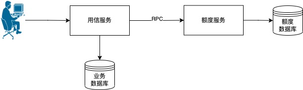
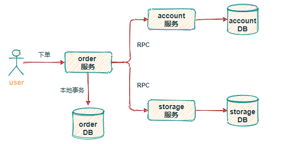
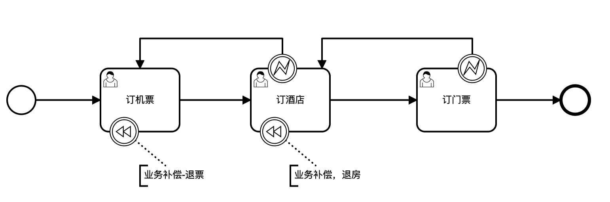
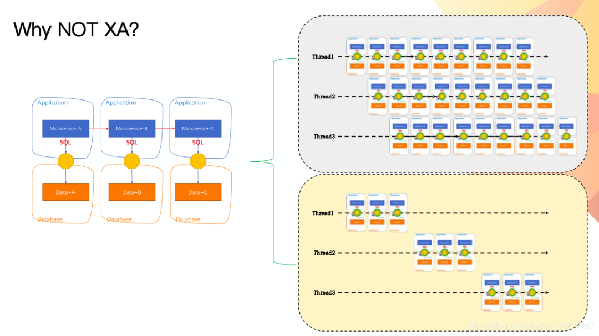
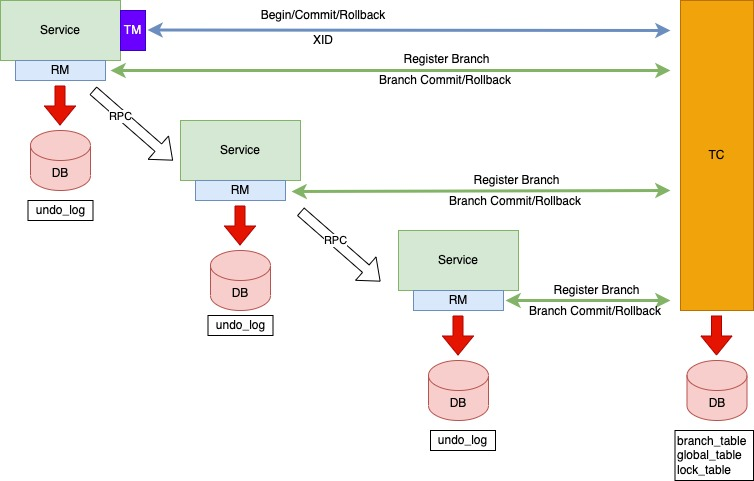

## Seata是什么

Seata是一款开源的分布式事务解决方案（`事务协调框架`），致力于在微服务架构下提供高性能和简单易用的分布式事务服务


### 诞生背景

•事务是数据库的概念，单一数据库的事务数据库可以保证；

•数据库的扩展带来了全局事务保证的问题。

| **数据库扩展方向** | **引发问题**                                       | **解决方案**              |
| ------------------ | -------------------------------------------------- | ------------------------- |
| 横向扩展  – 分表   | 业务侵入、**跨库事务**，跨库Join、排序，运维复杂等 | TiDB等分布式数据库        |
| 纵向扩展  – 分库   | **跨库事务**，跨库Join、排序                       | Seata等分布式事务协调框架 |

总体来说，Seata主要用于解决微服务架构下，多个服务（数据库）之间的**分布式事务**问题。分布式事务亦部分遵循 ACID 规范：

- 原子性：严格遵循
- 一致性：事务完成后的一致性严格遵循；事务中的一致性可适当放宽
- 隔离性：并行事务间不可影响；事务中间结果可见性允许安全放宽
- 持久性：严格遵循


一致性。简单的说，如果我们将一个数据从v1更新为v2，之后任意的数据读取：

- 强一致：每次都能确保读到v2，那么是强一致
- 弱一致：可能读到v1，也可能读到v2，那么是弱一致
- 最终一致：经过一定时间后，确保每次读取能够读到v2，那么是最终一致


**注意**：我们考察、选择分布式事务的解决方案，应当优先考察业务场景对`一致性`、`隔离性`的要求，其次再考虑`性能`、`业务侵入性`等


### 典型场景

- 场景A 微服务架构下，用信发起对额度服务的操作。

  

- 场景B 微服务架构下，电商系统的下单操作。

  

- 场景C 微服务架构下，代理机构为客户发起一整套定机票-定酒店->定旅游景点门票的操作。

  


## Seata解决方案


### XA

#### 解析

`XA`即经典的 两阶段提交，是由X/Open组织提出的分布式事务的规范，XA规范主要定义了(全局)事务管理器(TM)和(局部)资源管理器(RM)之间的接口。本地的数据库如mysql在XA中扮演的是RM角色。

XA一共分为两阶段：

```
第一阶段（prepare）：即所有的参与者RM准备执行事务并锁住需要的资源。参与者ready时，向TM报告已准备就绪。
第二阶段 (commit/rollback)：当事务管理者(TM)确认所有参与者(RM)都ready后，向所有参与者发送commit命令。
目前主流的数据库基本都支持XA事务，包括mysql、oracle、sqlserver、postgre
```

#### 特点

- `业务无侵入`，数据库层面支持XA协议即可
- 简单易理解，`开发较容易`
- 对资源进行了长时间的锁定，`并发度低`

### AT（★）

#### 解析

简单来说，AT是一个自实现的XA事务，相较于数据库层面的XA实现，自实现的AT具有更好的性能。



XA的阻塞带来的性能下降时非常厉害的，特别是你的分支事务非常多，每个资源的释放必须等到每个分支的数据库去单独释放，后续的事务才能进入。

XA虽然带来业务的无侵入，但是由于性能下降的程度太大，也就促使了AT的诞生。

#### 特点

- `业务无侵入`，数据库层面支持XA协议即可
- 简单易理解，`开发较容易`
- 对资源进行了锁定时间的优化，`并发度`相对XA有较大的提升。
- 有可能出现`脏回滚`，如果出现，需要人工介入。脏回滚一般是由于两个本地事务，一个被seata纳入了全局事务A当中，另一个则仅仅是本地事务，未被纳入另一个seata全局事务B中造成的。如果全局事务A回滚，则可能发生脏回滚。
- `SQL支持度`的问题，框架开发初期可能存在，社区发展至今，相信绝大部分场景的`SQL回滚`都是支持的。

### TCC

#### 解析

关于 TCC（Try-Confirm-Cancel）的概念，最早是由 Pat Helland 于 2007 年发表的一篇名为《Life beyond Distributed Transactions:an Apostate’s Opinion》的论文提出。

TCC分为3个阶段：

```
Try 阶段：尝试执行，完成所有业务检查（一致性）, 预留必须业务资源（准隔离性）
Confirm 阶段：确认执行真正执行业务，不作任何业务检查，只使用 Try 阶段预留的业务资源，Confirm 操作要求具备幂等设计，Confirm 失败后需要进行重试。
Cancel 阶段：取消执行，释放 Try 阶段预留的业务资源。Cancel 阶段的异常和 Confirm 阶段异常处理方案基本上一致，要求满足幂等设计。
```

以前文中的用信请求为例：

```
Try阶段冻结额度，但不实际使用额度。
Confirm阶段，将Try阶段的冻结额度划转到实际使用额度。
Concel阶段，则将Try阶段的冻结额度恢复至可用额度。
```

#### 特点

- `并发度较高`，无长期资源锁定。
- 直接侵入业务，`开发量较大`，需要提供Try/Confirm/Cancel接口。
- `一致性较好`，不会发生SAGA模式下的补偿
- TCC适用于订单类业务，对`中间状态有约束`的业务

#### 接口设计注意事项

- 允许空回滚 --- 因为网络原因，可能出现`Cancel操作`比`Try操作`先执行，这就要求`Cancel接口`中实现空回滚的逻辑。
- 防悬挂设计 --- 所谓悬挂，就是指`Cancel操作`先于`Try操作`到达；允许空回滚的同时，要防止回滚之后的`Try操作`执行。这就要求`Try操作`中实现防悬挂的逻辑。
- 幂等控制 --- 这个大家比较熟悉。

### SAGA

#### 解析

Saga是一篇数据库论文sagas提到的一个方案。其核心思想是将长事务拆分为多个本地短事务，由Saga事务协调器协调，如果正常结束那就正常完成，如果某个步骤失败，则根据相反顺序一次调用补偿操作。

此时的Seata核心是实现一个状态引擎，控制状态的流转与失败按序补偿操作。这一点实际上跟`camnuda`流程引擎的补偿事件类似。

总体来说，SAGA是一个长事务解决方案。

#### 特点

- `并发度高`，不用像XA事务那样长期锁定资源
- `侵入业务`，需要定义正常操作以及补偿操作，`开发量比XA大`
- `一致性较弱`，比如用信请求，如果使用SAGA，可能发生A用户额度先被使用（剩余可用额度实际减少），全局事务失败后，分支又对剩余可用额度进行补偿的操作（A可以感知到剩余可用额度先减少又被恢复）。
- 参与者可以采用事务驱动异步执行，`高吞吐`

#### 接口设计注意事项

- 允许空补偿 --- 因为网络原因，可能出现补偿操作比正向操作先执行，这就要求`补偿接口`中实现空补偿的逻辑。
- 防悬挂设计 --- 所谓悬挂，就是指补偿操先于正向操作到达；允许空补偿的同时，要防止补偿之后的正向操作执行。这就要求`正向操作`中实现防悬挂的逻辑。
- 幂等控制 --- 这个大家比较熟悉。

## Seata AT深入理解

### 事务交互流程

- 事务角色

```json
TM 全局事务管理者，即发起分布式事务的服务（分布式事务的起点）；
RM 分支事务管理者，即参与分布式事务的各个服务；
TC 全局事务协调者，即`Seata-Server`
```

- 事务流程图示



- 回滚关键

TC向RM发起回滚指令，RM本地的数据源代理对象（所有的`魔法`都来自于此），获取beforeImage内容进行业务数据的还原，还原成功后清除`undo_log`,`global_table`中的相关记录（二阶段事务提交成功，也会删除`undo_log`,`global_table`中的相关记录）。

此过程类似数据库本身实现的`undo_log`机制。


### AT如何保证隔离性

- 默认情况下，Seata 的全局事务是工作在读未提交隔离级别的，保证绝大多数场景的高效性。
- 在极端场景下，应用如果需要达到全局的`读已提交`，Seata 也提供了全局锁机制实现全局事务`读已提交`。

全局事务级`读已提交`防止脏读、脏写的原理以及过程，可以参考此文章-[详解Seata AT模式事务隔离级别与全局锁机制](https://seata.io/zh-cn/blog/seata-at-lock.html)，写的比较清楚了。


## Seata实践案例

这里以`AT`模式，实现下单操作为例。

（略）

## 补充：非框架解决方案


### 本地消息表

把复杂性留给调用方（类似seata的TM角色），调用方本地必须记录被调用方的请求记录以及处理调用状态，被调用方需要提供幂等接口。如果被调用方较多，复杂度指数增加。

### 事务消息

适用于不需要回滚的一些场景，业务上不要求必须是刚性事务。而且通常要求producer提供一个事务回查接口。

## 参考

[Seata是什么？一文了解其实现原理](https://cloud.tencent.com/developer/news/737595)

[Seata Saga模式](https://juejin.cn/post/6969550464744423437)

[分布式事务 Seata Saga 模式首秀以及三种模式详解 ](https://www.sofastack.tech/blog/sofa-meetup-3-seata-retrospect/)

[Seata 分布式事务 XA 与 AT 全面解析](https://developer.aliyun.com/article/919377)

[Seata-TCC模式 原理](https://juejin.cn/post/6969550286750744590)

[刚性事务与柔性事务](https://zhuanlan.zhihu.com/p/35842287)

[分布式事务最经典的七种解决方案](https://segmentfault.com/a/1190000040321750)

[我司最终选择了 Seata](https://www.cnblogs.com/chengxy-nds/p/14046856.html)

[github seata](https://github.com/seata/seata)

[github dtm](https://github.com/dtm-labs/dtm)