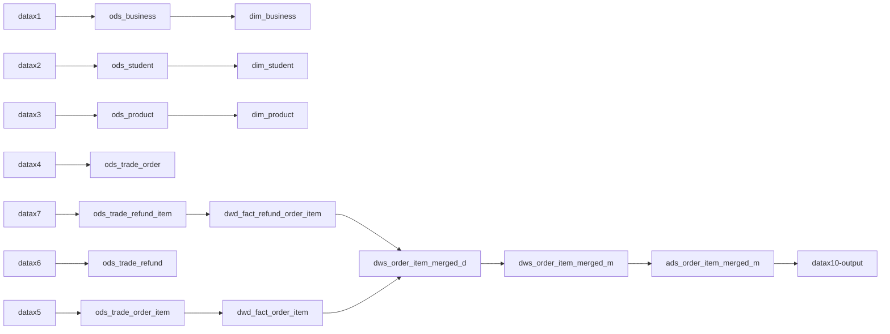
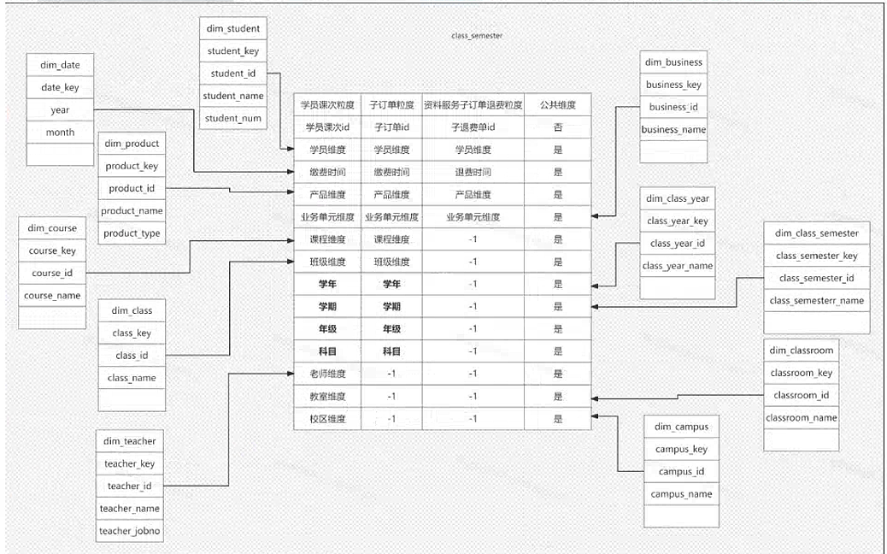

[TOC]

### 示例需求

#### 说明

	统计子订单维度的营收、退费信息，并合并两者进行上层的统计。表结构基本是从我们的业务库中取的部分字段。
	
	****



DS地址：http://10.10.9.120:12345/dolphinscheduler/ui



**相关数据都已经在hive的demodb中准备完毕**

#### 总体流程

- 设计数据加工维度与总体流程（ods,dim,dwd,dws,ads） -  业务+平台
- 建表（ods,dim,dwd,dws,ads）- 业务
- 实现每个节点SQL加工的逻辑，在hive客户端DBeaver中进行开发、验证  - 业务
- 在DS中配置整个加工流程，每个节点的逻辑为上一步的加工逻辑 - 业务 + 平台
- 在DS中集成datax完成数据的增量同步节点到DS工作流中 - 平台
- 在DS中集成datax完成数据推送节点 - 平台
- 执行整体的调度测试 - 业务 + 平台

### 建表（已完成，请勿重复建表）

#### ods

```
--- ods

CREATE TABLE `demodb.ods_business`(  
  `id` BIGINT,
  `code` STRING,
  `name` STRING,
  `bg_id` BIGINT)
ROW FORMAT DELIMITED FIELDS TERMINATED BY '\t';

CREATE TABLE `demodb.ods_student`(  
  `id` BIGINT,
  `number` STRING,
  `name` STRING)
ROW FORMAT DELIMITED FIELDS TERMINATED BY '\t';

CREATE TABLE `demodb.ods_product`(  
  `id` BIGINT,
  `code` STRING,
  `name` STRING,
  `type` STRING)
ROW FORMAT DELIMITED FIELDS TERMINATED BY '\t';

CREATE TABLE `demodb.ods_trade_order`(  
  `id` BIGINT,
  `order_num` STRING,
  `student_id` BIGINT,
  `order_status` INT,
  `pay_create_time` TIMESTAMP,
  `business_id` INT,
  `deleted` BOOLEAN,
  `sign_order_time` TIMESTAMP,
  `create_time` TIMESTAMP,
  `modified_time` TIMESTAMP,
  `create_uid` BIGINT,
  `modified_uid` BIGINT)
ROW FORMAT DELIMITED FIELDS TERMINATED BY '\t'; 

CREATE TABLE `demodb.ods_trade_order_item`(  
  `id` BIGINT,
  `order_id` BIGINT,
  `order_item_num` STRING,
  `product_id` BIGINT,
  `product_code` STRING,
  `business_id` INT,
  `total_num` INT,
  `payable_amount` DECIMAL,
  `practical_amount` DECIMAL,
  `order_status` TINYINT,
  `refund_status` TINYINT,
  `deleted` BOOLEAN,
  `create_time` TIMESTAMP,
  `modified_time` TIMESTAMP,
  `create_uid` BIGINT,
  `modified_uid` BIGINT)
ROW FORMAT DELIMITED FIELDS TERMINATED BY '\t';

CREATE TABLE `demodb.ods_trade_refund`(  
  `id` BIGINT,
  `refund_num` STRING,
  `order_id` BIGINT,
  `type` INT,
  `should_refund_amount` DECIMAL,
  `real_refund_amount` DECIMAL,
  `real_refund_time` TIMESTAMP,
  `refund_status` STRING,
  `deleted` BOOLEAN,
  `create_time` TIMESTAMP,
  `modified_time` TIMESTAMP,
  `create_uid` BIGINT,
  `modified_uid` BIGINT)
ROW FORMAT DELIMITED FIELDS TERMINATED BY '\t';

CREATE TABLE `demodb.ods_trade_refund_item`(  
  `id` BIGINT,
  `refund_id` BIGINT,
  `order_item_id` BIGINT,
  `refund_course_type` INT,
  `refund_count` INT,
  `should_refund_amount` DECIMAL,
  `real_refund_amount` DECIMAL,
  `deleted` BOOLEAN,
  `create_time` TIMESTAMP,
  `modified_time` TIMESTAMP,
  `create_uid` BIGINT,
  `modified_uid` BIGINT)
ROW FORMAT DELIMITED FIELDS TERMINATED BY '\t';
```


#### dwd

```
--- dwd

CREATE TABLE `demodb.dwd_fact_order_item`(  
  `id` BIGINT,
  `date_key` BIGINT COMMENT '缴费日期，来源sign_order_time',
  `product_key` BIGINT,
  `business_key` INT,
  `total_num` INT COMMENT '购买数量 默认1',
  `payable_amount` DECIMAL COMMENT '应付金额',
  `practical_amount` DECIMAL COMMENT '实付金额')
ROW FORMAT DELIMITED FIELDS TERMINATED BY '\t';

CREATE TABLE `demodb.dwd_fact_refund_order_item`(  
  `id` BIGINT,
  `order_item_id` BIGINT,
  `date_key` BIGINT COMMENT '缴费日期，来源sign_order_time',
  `product_key` BIGINT  COMMENT '购买产品，来源profuct_id',
  `business_key` INT COMMENT '业务单元，来源business_id',
  `refund_num` INT COMMENT '退费数量 默认1',
  `real_refund_amount` DECIMAL COMMENT '退费金额')
ROW FORMAT DELIMITED FIELDS TERMINATED BY '\t';
```


#### dim

```
--- dim
CREATE TABLE `demodb.dim_business`(  
  `business_key` BIGINT,
  `business_id` BIGINT,
  `business_code` STRING,
  `business_name` STRING,
  `bg_id` BIGINT,
  `bg_name` STRING)
ROW FORMAT DELIMITED FIELDS TERMINATED BY '\t';

CREATE TABLE `demodb.dim_student`(  
  `student_key` BIGINT,
  `student_id` BIGINT,
  `student_number` STRING,
  `student_name` STRING)
ROW FORMAT DELIMITED FIELDS TERMINATED BY '\t';

CREATE TABLE `demodb.dim_product`(  
  `product_key` BIGINT,
  `product_id` BIGINT,
  `product_name` STRING,
  `product_type` STRING)
ROW FORMAT DELIMITED FIELDS TERMINATED BY '\t';
```


#### dws

```
--- dws
CREATE TABLE `demodb.dws_order_item_merged_d`(  
  `date_key` INT,
  `product_key` BIGINT,
  `business_key` INT,
  `total_num` INT COMMENT '购买数量',
  `payable_amount` DECIMAL COMMENT '应付金额',
  `practical_amount` DECIMAL COMMENT '实付金额',
  `refund_num` INT COMMENT '退费数量 默认1',
  `real_refund_amount` DECIMAL COMMENT '退费金额')
ROW FORMAT DELIMITED FIELDS TERMINATED BY '\t';

CREATE TABLE `demodb.dws_order_item_merged_m`(
  `year_key` INT,
  `month_key` INT,
  `product_key` BIGINT,
  `business_key` INT,
  `total_num` INT COMMENT '购买数量',
  `payable_amount` DECIMAL COMMENT '应付金额',
  `practical_amount` DECIMAL COMMENT '实付金额',
  `refund_num` INT COMMENT '退费数量 默认1',
  `real_refund_amount` DECIMAL COMMENT '退费金额')
ROW FORMAT DELIMITED FIELDS TERMINATED BY '\t';
```


#### ads


```
CREATE TABLE `demodb.ads_order_item_merged_m`(
  `year_key` INT,
  `month_key` INT,
  `product_key` BIGINT,
  `business_key` INT,
  `total_num` INT COMMENT '购买数量',
  `payable_amount` DECIMAL COMMENT '应付金额',
  `practical_amount` DECIMAL COMMENT '实付金额',
  `refund_num` INT COMMENT '退费数量 默认1',
  `real_refund_amount` DECIMAL COMMENT '退费金额')
ROW FORMAT DELIMITED FIELDS TERMINATED BY '\t';
```

### 基础数据准备（已完成，请勿重复准备数据）

`以下数据已经导入到hive中`，请勿修改

#### ods_product

#### ods_student

#### ods_business

#### ods_trade_order

#### ods_trade_order_item

#### ods_trade_refund

####   ods_trade_refund_item

### dim加工过程（可反复执行）

```
--- 对应DS中的SQL节点
INSERT OVERWRITE TABLE demodb.dim_product
SELECT
    p.id AS product_key,
    p.id As product_id,
    p.name  AS product_name,
    p.type as product_type
FROM demodb.ods_product as p;

--- 对应DS中的sql节点
INSERT OVERWRITE TABLE demodb.dim_business
SELECT
    b.id AS business_key,
    b.id As business_id,
    b.code As business_code,
    b.name  AS business_name,
    b.bg_id AS bg_id,
    'todo' AS bg_name
FROM demodb.ods_business as b;

--- 对应DS中的SQL节点
INSERT OVERWRITE TABLE demodb.dim_student
SELECT
    s.id AS student_key,
    s.id As student_id,
    s.number  AS student_number,
    s.name as student_name
FROM demodb.ods_student as s;
```


### dwd事实表加工（可反复执行）

```
--- 对应DS中的SQL节点
INSERT OVERWRITE TABLE demodb.dwd_fact_order_item
SELECT
    o.id,
    CAST(FROM_UNIXTIME(UNIX_TIMESTAMP(p.pay_create_time), 'yyyyMMdd') AS INT) AS date_key,
    o.product_id AS product_key,
    o.business_id AS business_key,
    o.total_num AS total_num,
    o.payable_amount,
    o.practical_amount
FROM demodb.ods_trade_order_item o
JOIN demodb.ods_trade_order p ON o.order_id = p.id
AND p.order_status = 1 AND p.deleted = 0;

--- 对应DS中的SQL节点
INSERT OVERWRITE TABLE demodb.dwd_fact_refund_order_item
SELECT
    o.id,
    o.order_item_id,
    CAST(FROM_UNIXTIME(UNIX_TIMESTAMP(p.real_refund_time), 'yyyyMMdd') AS INT) AS date_key,
    i.product_id AS product_key,
    i.business_id AS business_key,
    COALESCE(o.refund_count, 0) AS refund_num, -- 设置默认值
    o.real_refund_amount AS real_refund_amount
FROM demodb.ods_trade_refund_item o
JOIN demodb.ods_trade_refund p ON o.refund_id = p.id
JOIN demodb.ods_trade_order_item i on i.id = o.order_item_id
```

### dws汇总表加工（可反复执行）

```
--- 对应DS中的SQL节点
--- 按日汇总：先对收入与退费分别按日汇总，再使用FULL OUTER JOIN做同维度的数据合并
WITH 
mid_order_item_d AS (
	SELECT
	    date_key,
	    product_key,
	    business_key,
	    SUM(total_num) AS total_num,
	    SUM(payable_amount) AS payable_amount,
	    SUM(practical_amount) AS practical_amount
	FROM demodb.dwd_fact_order_item
	GROUP BY
	    date_key,
	    product_key,
	    business_key
),
   
mid_refund_item_d AS (
    SELECT
        r.date_key,
        r.product_key,
        r.business_key,
        SUM(r.refund_num) AS refund_num,
        SUM(r.real_refund_amount) AS real_refund_amount
    FROM demodb.dwd_fact_refund_order_item r
    GROUP BY
        r.date_key,
        r.product_key,
        r.business_key
)

INSERT OVERWRITE TABLE demodb.dws_order_item_merged_d
SELECT
    COALESCE(o.date_key, r.date_key) AS date_key,
    COALESCE(o.product_key, r.product_key) AS product_key,
    COALESCE(o.business_key, r.business_key) AS business_key,
    COALESCE(o.total_num, 0) AS total_num,
    COALESCE(o.payable_amount, 0) AS payable_amount,
    COALESCE(o.practical_amount, 0) AS practical_amount,
    COALESCE(r.refund_num, 0) AS refund_num,
    COALESCE(r.real_refund_amount, 0) AS real_refund_amount
FROM mid_order_item_d o
FULL OUTER JOIN mid_refund_item_d r
    ON o.date_key = r.date_key 
    AND o.product_key = r.product_key 
    AND o.business_key = r.business_key;

--- 对应DS中的SQL节点
--- 按月汇总
INSERT OVERWRITE TABLE demodb.dws_order_item_merged_m
SELECT
    SUBSTR(CAST(o.date_key AS STRING), 1, 4) AS year,
    SUBSTR(CAST(o.date_key AS STRING), 5, 2) AS month,
    o.product_key,
    o.business_key,
    SUM(o.total_num) as total_num,
    SUM(o.payable_amount) As payable_amount,
    SUM(o.practical_amount) AS practical_amount,
    SUM(o.refund_num) AS refund_num,
    SUM(o.real_refund_amount) AS real_refund_amount
FROM demodb.dws_order_item_merged_d o
GROUP BY 
SUBSTR(CAST(o.date_key AS STRING), 1, 4),
SUBSTR(CAST(o.date_key AS STRING), 5, 2),
o.product_key,
o.business_key;
```

### ads应用表加工（可反复执行）

```
--- 对应DS中的SQL节点; 如有需要，此层可以关联维度表补充一些维度信息，比如product_name,product_code,business_name

INSERT OVERWRITE TABLE demodb.ads_order_item_merged_m
SELECT
    o.year_key,
    o.month_key,
    o.product_key,
    o.business_key,
    o.total_num,
    o.payable_amount,
    o.practical_amount,
    o.refund_num,
    o.real_refund_amount
FROM demodb.dws_order_item_merged_m o;

```

### 业务侧查询（可反复执行）

```
--- 以hive演示，实际在业务侧基于mysql SQL实现
SELECT
    o.year_key,    
    o.product_key,
    SUM(o.total_num) as total_num,
    SUM(o.payable_amount) as payable_amount,
    SUM(o.practical_amount) as practical_amount,
    SUM(o.refund_num) as refund_num,
    SUM(o.real_refund_amount) as real_refund_amount
FROM demodb.ads_order_item_merged_m o
GROUP BY 
o.year_key,
o.product_key
order by
o.year_key desc
```


### 数据集成（此处可暂时忽略）

#### datax数据同步配置示例

```
{
        "job": {
                "content": [{
                        "reader": {
                                "name": "mysqlreader",
                                "parameter": {
                                        "username": "root",
                                        "password": "Ssjy@2019",
                                        "connection": [{
                                                "querySql": [
"select id,product_id,class_year_id,class_semester_id,grade_id,subject_id,class_times,single_class_hour,class_hour_duration,description,deleted,create_time,modified_time,create_uid,modified_uid from pc_course where 1 = 1;"
                                                ],
                                                "jdbcUrl": [
"jdbc:mysql://192.168.60.160:3306/lwx-bu-test?useUnicode=true&characterEncoding=UTF-8&useSSL=false&allowLoadLocalInfile=false&autoDeserialize=false&allowLocalInfile=false&allowUrlInLocalInfile=false"
                                        ]}
                                        ]
                                }
                        },

                        "writer": {
                                "name": "hdfswriter",
                                "parameter": {
                                        "column": [{
                                                "name": "id",
                                                "type": "bigint"
                                        }, {
                                                "name": "product_id",
                                                "type": "bigint"
                                        }, {
                                                "name": "class_year_id",
                                                "type": "bigint"
                                        }, {
                                                "name": "class_semester_id",
                                                "type": "bigint"
                                        }, {
                                                "name": "grade_id",
                                                "type": "bigint"
                                        }, {
                                                "name": "subject_id",
                                                "type": "bigint"
                                        },{
                                                "name": "class_times",
                                                "type": "int"
                                        }, {
                                                "name": "single_class_hour",
                                                "type": "int"
                                        }, {
                                                "name": "class_hour_duration",
                                                "type": "int"
                                        }, {
                                                "name": "description",
                                                "type": "string"
                                        }, {
                                                "name": "deleted",
                                                "type": "boolean"
                                        }, {
                                                "name": "create_time",
                                                "type": "timestamp"
                                        }, {
                                                "name": "modified_time",
                                                "type": "timestamp"
                                        }, {
                                                "name": "create_uid",
                                                "type": "bigint"
                                        }, {
                                                "name": "modified_uid",
                                                "type": "bigint"
                                        }],
                                        "defaultFS": "hdfs://hadoop1:9000",
                                        "fieldDelimiter": "\t",
                                        "fileName": "tmp_pc_course",
                                        "fileType": "text",
                                        "path": "/user/hive/warehouse/demodb.db/tmp_pc_course",
                                        "writeMode": "truncate"
                                }
                        }
                }],
                "setting": {
                        "speed": {
                                "channel": 1,
                                "tps": 1000
                        },
                        "errorLimit": {
                                "record": 10,
                                "percentage": 0.1
                        }
                }
        }
}
```

hive建表tmp_pc_course

```
CREATE TABLE `demodb.tmp_pc_course`(  
  `id` BIGINT,
  `product_id` bigint,
  `class_year_id` bigint,
  `class_semester_id` bigint,
  `grade_id` bigint,
  `subject_id` bigint,
  `class_times` int,
  `single_class_hour` int,
  `class_hour_duration` int,
  `description` STRING,
  `deleted` boolean,
  `create_time` TIMESTAMP,
  `modified_time` TIMESTAMP,
  `create_uid` BIGINT,
  `modified_uid` BIGINT)
ROW FORMAT DELIMITED FIELDS TERMINATED BY '\t';
```

hive建表ods_pc_course

```
CREATE TABLE `demodb.ods_pc_course`(  
  `id` BIGINT,
  `product_id` bigint,
  `class_year_id` bigint,
  `class_semester_id` bigint,
  `grade_id` bigint,
  `subject_id` bigint,
  `class_times` int,
  `single_class_hour` int,
  `class_hour_duration` int,
  `description` STRING,
  `deleted` boolean,
  `create_time` TIMESTAMP,
  `modified_time` TIMESTAMP,
  `create_uid` BIGINT,
  `modified_uid` BIGINT)
ROW FORMAT DELIMITED FIELDS TERMINATED BY '\t';
```


#### datax数据推送配置示例

```
{
        "job": {
                "content": [{
                        "reader": {
                                "name": "rdbmsreader",
                                "parameter": {
                                        "username": "hive",
                                        "password": "hive",
                                        "connection": [{
                                                "querySql": [
                                                        "select id,name,code,enabled,sort_num,create_time,modified_time,create_uid,modified_uid from ods_demo_bg"
                                                ],
                                                "jdbcUrl": [
                                                        "jdbc:hive2://10.10.9.119:10000/default"
                                                ]
                                        }]
                                }
                        },
                        "writer": {
                                "name": "mysqlwriter",
                                "parameter": {
                                		"writeMode": "replace",
                                        "username": "root",
                                        "password": "Ssjy@2019",
                                        "column": [
                                                "id",
                                                "name",
                                                "code",
                                                "enabled",
                                                "sort_num",
                                                "create_time",
                                                "modified_time",
                                                "create_uid",
                                                "modified_uid"
                                        ],
                                        "connection": [{
                                                "table": [
                                                        "demo_bg"
                                                ],
                                                "jdbcUrl": "jdbc:mysql://192.168.60.160:3306/lwx-bu-test?useUnicode=true&characterEncoding=UTF-8&useSSL=false&allowLoadLocalInfile=false&autoDeserialize=false&allowLocalInfile=false&allowUrlInLocalInfile=false"
                                        }]
                                }
                        }
                }],
                "setting": {
                        "speed": {
                                "channel": 1,
                                "tps": 1000
                        },
                        "errorLimit": {
                                "record": 1,
                                "percentage": 0.01
                        }
                }
        }
}
```

mysql建表demo_bg

```
CREATE TABLE `demo_bg` (
  `id` int(11) NOT NULL AUTO_INCREMENT COMMENT '主键',
  `name` varchar(255) DEFAULT NULL COMMENT '事业部名称',
  `code` varchar(64) NOT NULL COMMENT '事业部唯一编码',
  `enabled` tinyint(4) NOT NULL DEFAULT '1' COMMENT '是否可用',
  `sort_num` int(11) DEFAULT NULL COMMENT '排序',
  `create_time` datetime DEFAULT NULL COMMENT '创建时间',
  `modified_time` datetime DEFAULT NULL COMMENT '修改时间',
  `create_uid` bigint(20) DEFAULT NULL COMMENT '创建人',
  `modified_uid` bigint(20) DEFAULT NULL COMMENT '修改人',
  PRIMARY KEY (`id`) USING BTREE,
  UNIQUE KEY `uni_code` (`code`) USING BTREE COMMENT '编码唯一索引'
) ENGINE=InnoDB AUTO_INCREMENT=6 DEFAULT CHARSET=utf8mb4 ROW_FORMAT=DYNAMIC COMMENT='事业部表';
```


### 环境隔离

1，开发环境后续会基于现有的环境 

2，生产环境会跟运维组申请额外的资源，搭建一套新的环境。 

### 任务

今日任务
1，完成表的设计评审。ods,dwd,dws,ads各层的表的字段
2，完成DS中调度流的案例
注意事项
1，dwd表中不允许出现空值（维度+度量）
2，（学年学期，年级科目）事实表中维度退化到dim_course