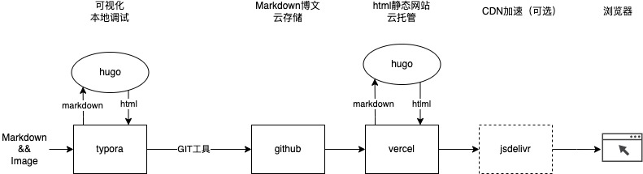

## 


## 使用hugo+github+jsdelivr+typora+vercel打造静态博客的步骤与关键


### 步骤说明

此文的阅读对象主要是有开发背景的同学，内容是讲述静态博客的打造思路。


- Typora - markdown格式博文的写作工具，方便我们日常编写博客文章。
- Github - markdown格式博客文章 + image文件的仓库，主要用来存储编写的博客，通常需要配合git版本控制工具使用。
- Hugo - 静态网站的“编译”工厂，输入原料是markdown格式的博客文章+静态image文件，输出则是静态的html博客文件。
- Jsdelivr - 免费的CDN加速服务提供商，可以给我们的静态博客的图片、视频进行加速。
- vercel - 免费的静态网站编译、托管工具，提供一站式的网站托管服务。





### 静态网站的痛点有哪些？


#### *图片备份与稳定加速*

静态网站的痛点是图片的托管，要兼顾稳定性与备份的需要。出于备份的需要，我们 要求图片必须保存在github中；稳定性呢，则要么使用付费的第三方图片存储与加速服务（比如阿里云，七牛云），要么使用免费但稳定的jsdelivr图片加速服务，它可以与gi thub代码库无缝集成，任何代码库中的图片，均可以使用如下格式直接进行加速访问：

```html
https://cdn.jsdelivr.net/gh/{GITHUB用户名}/{GITHUB代码库名}/图片在仓库中的相对路径.图片后缀
```

而hugo正好有一项pageBundles功能，其核心是将一篇文章的markdown文件与图片组织在一个目录下，其中目录名编译后对应文章名，markdown文件名则同意为index.md。比如我的一篇文章：


*开启pageBundles的步骤*

- 文章组织形式按上面图片类似的格式进行 组织。

- 每篇博文中（index.md）指定：`usePageBundles: true`

- 主题中负责图片渲染src的地方稍做修改：

  比如我就在themes/*hugo-clarity*/layouts/partials/figure.html中修改了渲染的逻辑

  ```html
  {{/*
    If Hugo has been able to access the image, it's loaded at .image, and we have
    access to additional attributes.
  
    If Hugo hasn't been able to access the image, it's loaded at .file, with only
    its path available.
  
    We set the Hugo variables to strings to allow for logical operations and
    replacements.
  */}}
  
  {{- $file := .file -}}
  {{- $image := .image -}}
  {{- $diskPath := .diskPath -}}
  {{- $webPath := .webPath -}}
  {{- $alt := .alt -}}
  {{- $cap := .cap -}}
  {{- $classes := .classes -}}
  {{- $bundle := .bundle -}}
  
  {{- $fileWeb := .file -}}
  {{- if eq $bundle true -}}
    {{ $fileWeb = path.Join $webPath $file }}
    {{ if in $classes "image_svg" }}
      {{ if strings.HasPrefix $file "http" }}
        {{ $fileWeb = $file }}
      {{- end -}}
    {{- end -}}
  {{- end -}}
  
  <figure>
    <picture>
  
      {{/* Generate alternate image format tags. */}}
      {{- with $file -}}
        {{ $name := replace $file (path.Ext $file) "" }}
        {{ $ext := slice "avif" "webp" "jxl" }}
        {{- range $ext -}}
          {{ $item := printf "%s" . | printf "%s%s" "." | printf "%s%s" $name | printf "%s" }}
          {{ $itemDisk := path.Join $diskPath $item }}
          {{ $itemWeb := path.Join $webPath $item }}
          {{- if fileExists $itemDisk -}}
            <source srcset="{{ $itemWeb }}" type="image/{{ . }}">
          {{- end -}}
        {{- end -}}
      {{- end -}}
  
      {{/* Render image and attributes. */}}
      
  
      {{/* Provide caption based on image title, if it is set. */}}
      {{- with $cap -}}
        {{- if not (eq $cap " ") -}}
          <figcaption class="{{ replace $classes "image" "caption" }}">{{ $cap | safeHTML }}</figcaption>
        {{- end -}}
      {{- end -}}
  
    </picture>
  </figure>
  
  ```

  其中即是修改之处：

  ```html
          {{ if eq $bundle true }}
            src="https://cdn.jsdelivr.net/gh/tfnick/blog/content{{ .RelPermalink }}"
          {{ else }}
            src="{{ .RelPermalink }}"
          {{ end }}
  ```

  

#### *图片插入的便捷性*

图片的插入便捷性通过typora来解决，包括：

- 截图插入，需要能保证图片能自动存储到index.md所在目录
- 如果引用（复制）的第三方网站的文章与图片，需要保证图片能自动保存到计算机本地index.md所在的目录
- 插入本地的图片，也需要能保证可以自动复制图片到index.md所在目录


所幸的是，typora只需要经过简单的配置即可达到上述要求。


`注`此方案下，不再需要使用pigGo等图片上传工具将 图片上传到jsdelivr，更进一步的简化了博文的编写。


### vercel网站托管

vercel与github配置好之后，其可以指定hugo的版本，自动编译html并发布到vercel的*容器*中，配置好自有域名之后，基本上可谓一劳永逸。


### 优势

一个静态博客配置完成之后，通过typora编写文章，通过git提交到github，后续的发布全部由vercel自动完成，写作者不再需要关注，可以真正享受写文章的乐趣，NICE～

