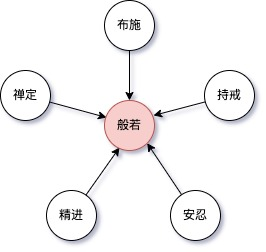
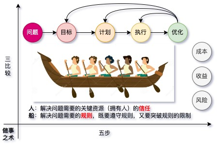

## 做人之道

- 修心
  - 万法皆空，因果不空
    - 因缘和合虚妄有生：他来了，缘聚，他走了，缘散； 你找他，缘起，你不找他，缘灭。 找到是缘起，找不到是缘尽。 走过的路，见过的人，*各有其因*，*各有其缘*。 多行善业，缘聚自能相见。
    - 随缘不攀缘；体不变，用随缘
      - 生际必死
      - 聚际必散
      - 高际必堕
    - 善分别：分别而不执著
    - 内调心性，外敬他人
    - 上善若水，水利万物而不争（不争者，能掌控欲望也，亦谓之谦，利他之心）
  - 应无所住而生其心
    - 事上拿起，心上放下
    - 空有不二
  
- 修行
  - 六波罗蜜
    - 布施
    - 持戒
    - 安忍
    - 精进
    - 禅定
    - 般若

  

## 做事之术

- 五步三比较法

  

  注意：任何的事业或者工作涉及到的"人"及其"立场"，都是重中之重，我们要分清工作为谁而做，我们应当联合谁，又应当反对谁？

- 例：[《中国社会各阶层的分析》](http://home.ustc.edu.cn/~hexukun/1.html)

- 例：[《湖南省农民运动考察报告》](https://www.marxists.org/chinese/maozedong/marxist.org-chinese-mao-192703.htm)

- 例：外贸TopSales是如何搞定大客户，年入超过200万？

  ​       我一朋友，他们公司主要做某个细分市场，之前年营收接近1000万美金，朋友的老板一直希望销售业绩能够有较大的突破，幸运的是，他招来了一个像董宇辉一样的高价值销售，后来成为了他公司的业绩黑马。

​	   		这位黑马就是我的朋友，他有强烈的赚钱欲望，这也是公司老板招募他的原因之一。他后来跟我透露，他做大客户的秘密：

1，清晰的目标，厘清目标大客户的画像，将精力聚焦在潜在的大客户身上，赢得大客户负责人的信任。

2，勇于打破规则，在不损害公司的利益的前提下，以客户为中心，不为规则所束缚。

​		在别的销售还在“兢兢业业”的写开发信开发客户的时候，他已经在搜索行业可能的潜在大客户名单；在别的销售还在被公司各种产品销售规则所限制的时候，他跳出规则，站在行业发展的视角，为客户做了很多贴心的建议，赢得了客户的赞誉和信任。

​		后来，他成功拿下几个大客户，一鸣惊人，迅速成为公司的业绩黑马。诚然，做大客户有一定的运气成分，他的成功或许有运气加持，但背后的思维方式和做事方法更值得我们学习。

